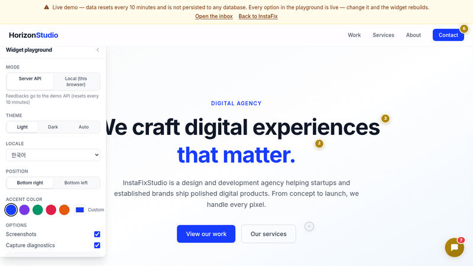

<div align="center">

<h1>SitePing</h1>

**Client feedback, pinned to the pixel.**

A lightweight feedback widget that lets your clients annotate websites during development.
Draw rectangles, leave comments, track bugs — directly on the live site.



[](https://siteping.dev)
[](https://siteping.dev/demo)
[](https://siteping.dev/docs)
[](https://www.npmjs.com/package/@siteping/widget)
[](https://www.npmjs.com/package/@siteping/widget)
[](./LICENSE)
[](https://github.com/NeosiaNexus/SitePing/actions)
[](https://github.com/NeosiaNexus/SitePing/security/code-scanning)
[](https://app.codecov.io/gh/NeosiaNexus/SitePing)
[](https://scorecard.dev/viewer/?uri=github.com/NeosiaNexus/SitePing)
[](https://www.typescriptlang.org/)
[-blue)](./packages/widget/.size-limit.json)

[**Documentation**](https://siteping.dev/docs) &middot; [Quickstart](https://siteping.dev/docs/quickstart) &middot; [Live Demo](https://siteping.dev/demo) &middot; [Contributing](./CONTRIBUTING.md)

</div>

> **[See SitePing in action →](https://siteping.dev/demo)** — Draw annotations, leave feedback, track bugs directly on the live site.

---

## Why SitePing?

Stop chasing client feedback across Slack threads, email chains, and Notion docs. SitePing gives your clients a **contextual** way to leave feedback — anchored to the exact element they're looking at.

| | SitePing | Marker.io | BugHerd |
|---|---|---|---|
| **Self-hosted** | Yes — your DB, your data | No (SaaS) | No (SaaS) |
| **npm package** | `npm install` and go | npm + script tag | Script tag only |
| **Framework-native** | First-class Next.js support | Framework-agnostic | Framework-agnostic |
| **Pricing** | Free & open source | From $39/mo | From $42/mo |
| **DOM-anchored annotations** | Multi-selector (CSS + XPath + text) | Screenshot-based | Pin-based |
| **Annotations survive layout changes** | Yes (percentage-relative rects) | No (pixel coordinates) | Partially |

## Features

- **Rectangle annotations** — clients draw directly on the page, with category + message
- **DOM-anchored persistence** — annotations tie to elements, not pixels; they survive layout changes
- **Instant right-click comments** — opt-in, and it never hijacks keyboard or modifier-key context menus
- **Screenshots + diagnostics** — opt-in JPEG of the annotated area (with privacy masking) and console/network capture
- **Triage inbox** — `<SitepingInbox />` (`@siteping/dashboard`): Linear-style, keyboard-first, light/dark, 7 locales
- **Reliability built in** — retry with backoff plus a localStorage queue; a flaky network never loses a comment
- **Shadow DOM isolation** — widget CSS never leaks into your site, and your site CSS never breaks the widget
- **Dev-only by default** — auto-hides in production builds unless `forceShow: true`
- **Lightweight** — ~30 KB gzipped (ESM); the panel, screenshot engine, and non-English locales load on demand

## Quickstart

```bash
npm i @siteping/widget @siteping/adapter-prisma
npx @siteping/cli init   # adds the Prisma models + generates the API route
npx prisma db push
```

```tsx
"use client";
import { useSiteping } from "@siteping/widget/react";

export function Feedback() {
  useSiteping({ endpoint: "/api/siteping", projectName: "my-app" });
  return null;
}
```

Your clients can now draw rectangles on the site and leave feedback. Triage it with one component:

```tsx
import { SitepingInbox } from "@siteping/dashboard";

<SitepingInbox projects="my-app" endpoint="/api/siteping" theme="auto" />
```

No server? The widget also runs fully client-side with `store: new LocalStorageStore()` — the [three-minute quickstart](https://siteping.dev/docs/quickstart) covers both paths, prerequisites included.

## Documentation

The full documentation lives at **[siteping.dev/docs](https://siteping.dev/docs)** (English and French) — every option, default, and behavior on these pages is verified against the source code.

| Package | | Docs |
|---|---|---|
| [`@siteping/widget`](./packages/widget) | The feedback widget (framework-agnostic + React hook) | [Widget](https://siteping.dev/docs/widget) · [Configuration](https://siteping.dev/docs/widget/configuration) · [Screenshots](https://siteping.dev/docs/widget/screenshots) |
| [`@siteping/dashboard`](./packages/dashboard) | Triage inbox component + headless hook | [Dashboard](https://siteping.dev/docs/dashboard) · [Theming](https://siteping.dev/docs/dashboard/theming) |
| [`@siteping/adapter-prisma`](./packages/adapter-prisma) | Production server adapter (auth, CORS, webhooks) | [Prisma adapter](https://siteping.dev/docs/adapters/prisma) |
| [`@siteping/adapter-memory`](./packages/adapter-memory) | In-memory store (tests, demos) | [Memory adapter](https://siteping.dev/docs/adapters/memory) |
| [`@siteping/adapter-localstorage`](./packages/adapter-localstorage) | Client-side store (zero server) | [localStorage adapter](https://siteping.dev/docs/adapters/localstorage) |
| [`@siteping/cli`](./packages/cli) | `init` / `sync` / `status` / `doctor` | [CLI](https://siteping.dev/docs/cli) |

## Contributing

Bug reports, locale translations, docs fixes, features — everything counts, and locale additions are the friendliest first PR. Start with [CONTRIBUTING.md](./CONTRIBUTING.md).

Maintaining a fork with extra features (semantic anchors, screenshot storage backends, positioning fixes have all come from forks)? An upstream PR — or even an issue describing what you built — lets everyone benefit.

## Contributors

Every line of code, locale, doc fix, and bug report makes SitePing better. Huge thanks to everyone who has shown up — first-time contributors especially.

This project follows the [all-contributors](https://allcontributors.org) specification — every kind of contribution counts ([emoji key](https://allcontributors.org/docs/en/emoji-key)).

<!-- ALL-CONTRIBUTORS-LIST:START - Do not remove or modify this section -->
<!-- prettier-ignore-start -->
<!-- markdownlint-disable -->
<table>
  <tbody>
    <tr>
      <td align="center" valign="top" width="14.28%"><a href="https://github.com/NeosiaNexus"><br /><sub><b>Olsen Matheo</b></sub></a><br /><a href="https://github.com/NeosiaNexus/SitePing/commits?author=NeosiaNexus" title="Code">💻</a> <a href="#maintenance-NeosiaNexus" title="Maintenance">🚧</a> <a href="https://github.com/NeosiaNexus/SitePing/commits?author=NeosiaNexus" title="Documentation">📖</a> <a href="#design-NeosiaNexus" title="Design">🎨</a> <a href="#infra-NeosiaNexus" title="Infrastructure (Hosting, Build-Tools, etc)">🚇</a> <a href="#ideas-NeosiaNexus" title="Ideas, Planning, & Feedback">🤔</a> <a href="https://github.com/NeosiaNexus/SitePing/pulls?q=is%3Apr+reviewed-by%3ANeosiaNexus" title="Reviewed Pull Requests">👀</a> <a href="https://github.com/NeosiaNexus/SitePing/commits?author=NeosiaNexus" title="Tests">⚠️</a> <a href="#projectManagement-NeosiaNexus" title="Project Management">📆</a></td>
      <td align="center" valign="top" width="14.28%"><a href="https://github.com/alceops"><br /><sub><b>Alce</b></sub></a><br /><a href="https://github.com/NeosiaNexus/SitePing/commits?author=alceops" title="Code">💻</a> <a href="#translation-alceops" title="Translation">🌍</a> <a href="https://github.com/NeosiaNexus/SitePing/commits?author=alceops" title="Tests">⚠️</a></td>
      <td align="center" valign="top" width="14.28%"><a href="https://github.com/reikjarloekl"><br /><sub><b>Jörn Bungartz</b></sub></a><br /><a href="https://github.com/NeosiaNexus/SitePing/issues?q=author%3Areikjarloekl" title="Bug reports">🐛</a> <a href="https://github.com/NeosiaNexus/SitePing/commits?author=reikjarloekl" title="Code">💻</a></td>
      <td align="center" valign="top" width="14.28%"><a href="http://innovation-agents.de"><br /><sub><b>Andi Keßler</b></sub></a><br /><a href="https://github.com/NeosiaNexus/SitePing/commits?author=andinger" title="Code">💻</a> <a href="https://github.com/NeosiaNexus/SitePing/commits?author=andinger" title="Tests">⚠️</a> <a href="https://github.com/NeosiaNexus/SitePing/commits?author=andinger" title="Documentation">📖</a> <a href="#ideas-andinger" title="Ideas, Planning, & Feedback">🤔</a> <a href="https://github.com/NeosiaNexus/SitePing/issues?q=author%3Aandinger" title="Bug reports">🐛</a></td>
      <td align="center" valign="top" width="14.28%"><a href="https://github.com/grizodubov"><br /><sub><b>Valerii</b></sub></a><br /><a href="https://github.com/NeosiaNexus/SitePing/commits?author=grizodubov" title="Code">💻</a></td>
      <td align="center" valign="top" width="14.28%"><a href="https://github.com/sjh9714"><br /><sub><b>JinHyuk Sung</b></sub></a><br /><a href="https://github.com/NeosiaNexus/SitePing/commits?author=sjh9714" title="Code">💻</a> <a href="https://github.com/NeosiaNexus/SitePing/commits?author=sjh9714" title="Tests">⚠️</a> <a href="https://github.com/NeosiaNexus/SitePing/issues?q=author%3Asjh9714" title="Bug reports">🐛</a></td>
      <td align="center" valign="top" width="14.28%"><a href="https://www.sendung.de/"><br /><sub><b>Marian Steinbach</b></sub></a><br /><a href="https://github.com/NeosiaNexus/SitePing/issues?q=author%3Amarians" title="Bug reports">🐛</a> <a href="#ideas-marians" title="Ideas, Planning, & Feedback">🤔</a></td>
    </tr>
    <tr>
      <td align="center" valign="top" width="14.28%"><a href="https://humen.lmm.best/mcp/"><br /><sub><b>LIghtJUNction</b></sub></a><br /><a href="https://github.com/NeosiaNexus/SitePing/commits?author=LIghtJUNction" title="Code">💻</a> <a href="https://github.com/NeosiaNexus/SitePing/commits?author=LIghtJUNction" title="Tests">⚠️</a></td>
      <td align="center" valign="top" width="14.28%"><a href="https://rehansanjay-portfolio.vercel.app/"><br /><sub><b>Rehuz</b></sub></a><br /><a href="https://github.com/NeosiaNexus/SitePing/commits?author=Rehansanjay" title="Code">💻</a> <a href="https://github.com/NeosiaNexus/SitePing/commits?author=Rehansanjay" title="Tests">⚠️</a> <a href="https://github.com/NeosiaNexus/SitePing/commits?author=Rehansanjay" title="Documentation">📖</a></td>
      <td align="center" valign="top" width="14.28%"><a href="https://vongohren.me/"><br /><sub><b>Snorre Lothar von Gohren Edwin</b></sub></a><br /><a href="#ideas-vongohren" title="Ideas, Planning, & Feedback">🤔</a></td>
    </tr>
  </tbody>
</table>

<!-- markdownlint-restore -->
<!-- prettier-ignore-end -->

<!-- ALL-CONTRIBUTORS-LIST:END -->

> Want to be in this list? Code, docs, translations, bug reports, design ideas — all count. See [CONTRIBUTING.md](./CONTRIBUTING.md) to get started. The [@all-contributors](https://allcontributors.org/docs/en/bot/usage) bot can add you automatically when a maintainer comments `@all-contributors please add @your-username for code, doc`.

### Activity


<sub>Activity graph powered by <a href="https://repobeats.axiom.co">Repobeats</a>.</sub>

---

## Star History

[](https://star-history.com/#NeosiaNexus/SitePing&Date)

---

## License

[MIT](./LICENSE)

---

<div align="center">
  <sub>Built by <a href="https://github.com/neosianexus">@neosianexus</a></sub>
</div>
