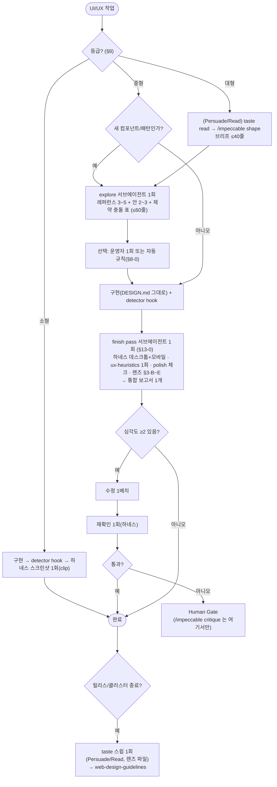

# UI/UX 자동화 개발 — Quickstart v5

> **기준일:** 2026-08-23 · **개정 v5.1 (같은 날, 속도 최적화)** — 품질 구조는 그대로 두고 **비용 구조**를 바꿨다: 조사·검증은 서브에이전트,
> 검증은 "finish pass" 1회 묶음, E2E 는 고정 픽스처 하네스(라운드당 초 단위), 보고서는 기능당 1개, 등급별 **예산**이 곧 규칙. 개정 항목은
> 본문에 **(v5.1)** 로 표시했고, 요약은 §0-1·§25~§27. 기존 v5 프로젝트는 §24-1 의 30분 절차로 따라온다.  
> **대상:** Claude Code 기반 웹/앱 UI 개발 프로젝트 — **특정 프로젝트·스택에 종속되지 않는다.** 예시 경로(`app/globals.css`, `components/ui.tsx` 등)는
> 자기 프로젝트의 토큰·프리미티브 위치로 바꿔 읽는다.  
> **핵심 원칙:** **Single Design Authority + Independent Validators + Taste Lens + (v5.1) Budgeted Validation**  
> **v4에서의 핵심 변경:** `taste-skill`(anti-slop 계열)을 **Creator가 아니라 Validator 계층**에 정식 편입한다.
> taste는 Impeccable이 설계하기 **전엔 읽어주고**(taste read → shape 브리프 입력), 만든 **뒤엔 빈틈을 찾아주되**(taste lens → polish 입력),
> **고치는 건 언제나 Impeccable**이다. 그 외 v4의 권위 구조·검증 계층·3회 루프·로그 정책은 그대로 유지한다.
>
> 이 문서는 **새 프로젝트를 v5 방식으로 구성할 때** 사용하는 실행 가이드다.  
> 기존 v4 환경은 §24의 짧은 전환 절차만 적용하면 된다. v3.x 환경은 `uiux-auto-mig.md`로 v4까지 먼저 올린다.

---

## 0. v5가 해결하려는 문제

v4는 다음을 확립했다.

- Design Authority는 Impeccable 하나뿐이다.
- PRODUCT.md(제품 맥락)·DESIGN.md(디자인 계약)·코드 토큰을 분리하고, 어긋나면 Design Drift로 보고한다.
- Playwright(실제 동작)·ux-heuristics(사용성)·web-design-guidelines(릴리스)가 독립 검증자다.
- 자동 수정 루프는 3회, 넘기면 critique + Human Gate + shape로 승격한다.

하지만 v4의 검증자 셋은 모두 **"동작하는가·쓸 수 있는가·표준을 지키는가"**를 본다. 다음 축은 어느 검증자도 소유하지 않았다.

1. **상태 완전성** — loading / empty / error / success / disabled / permission 상태가 전부 있는가.
2. **전략적 누락** — 법률 링크, 404, skip 링크, 뒤로 가기, 인라인 검증, 재시도 경로처럼 "AI가 늘 빼먹는 것".
3. **템플릿성** — 같은 레이아웃 패밀리 반복, 같은 의도의 CTA 중복, 카드 스캐폴드 남용처럼 "어느 제품이어도 똑같을 화면".
4. **설계 전 읽기** — 이 화면을 무엇으로 읽고(Persuade/Read/Operate), 무엇을 보존하고 무엇을 버릴지 한 줄로 고정하는 일.

anti-slop 계열 스킬(`taste-skill` 등)은 정확히 이 축을 다룬다. 그런데 이 스킬들은 동시에 **서체 교체·모션 추가·grain·비대칭 레이아웃** 같은 표현 레버를 함께 제안하고, 스스로 코드를 고치려 든다. 그대로 두면 v3의 "여러 스킬이 Authority" 문제가 되살아난다.

v5의 답은 역할을 둘로 가르는 것이다.

> **taste = 읽어주고 찾아주는 렌즈. 고치지 않는다.**  
> **Impeccable = 여전히 유일한 Creator. 마지막 손은 항상 Impeccable.**

taste를 실제 운용해 본 결과(2026-08-22, 한 프로젝트 전 화면 감사)도 이 분담을 뒷받침한다. 채택된 항목은 대부분 **측정을 촉발한 가설**(13개 테마 대비 61건 미달, 태블릿 히어로 잘림), **상태·누락**(네이티브 `confirm` 10곳, 로드 실패 영구 로딩, 법률 링크·skip 링크·404 부재), **레이아웃 패밀리 교체**(카드 4장 → 카드 1장 + 구분선)였고, 표현 레버는 전부 프로젝트 제약과 충돌해 기각됐다. 즉 taste가 주는 것은 **craft floor(빈틈 제거)**이지 **표현력**이 아니다. 표현은 DESIGN.md 세계 안에서 Impeccable(`bolder`·`delight`·`typeset`·`layout`)과 생성 이미지 에셋이 담당한다.

## 0-1. (v5.1) v5 를 그대로 운용하면 비용이 어디서 나는가

v5 를 한 프로젝트(약 1주, 스킬 호출 50회, UX 보고서 37개)에 실제로 적용해 본 결과, 품질은 목표에 닿았지만 **개발 시간과 토큰이 과도**했다.
원인은 스킬 자체가 아니라 **호출 구조**였다. 어떤 프로젝트든 같은 구조면 같은 낭비가 난다.

| 낭비 | 왜 생기나 | v5.1 조치 |
|---|---|---|
| **검증 라운드마다 환경을 다시 만든다** | 로그인·시드 데이터·(암호화 제품이면) 브라우저 저장소가 새 컨텍스트마다 사라져 매 라운드 준비에 1~2분 | **E2E 픽스처 하네스**(§25): 영구 브라우저 프로필 + 고정 픽스처 1회 시드 → 라운드당 수 초 |
| **스킬 본문이 크다** | ux-heuristics(본문 250줄 + 참고 4,500줄)·taste(1,200줄)·ux-researcher(400줄 + 참고 3,400줄). 호출 1회 = 지시문 10~20k 토큰 | 참고 문서(`references/`) 열람 금지 · taste 는 렌즈 파일(≤150줄)로만 · ux-researcher 는 evidence 파일이 있을 때만 · **호출 상한**(§17) |
| **기능당 검증 5~6패스** | detector → Playwright → heuristics → taste lens → polish → Playwright 재검증. 발견의 대부분은 첫 패스에서 나온다 | **finish pass 1회 묶음**(§13-0) → 수정 1배치 → 재확인 1회 |
| **산출물이 많다** | heuristics·taste·polish 보고서를 따로, 스크린샷 전체 화면 | **통합 보고서 1개**(§19) · 스크린샷은 결함 부위 clip |
| **주 컨텍스트 오염** | 조사·감사 결과 전문이 대화에 남아 이후 모든 턴이 다시 읽는다 | **서브에이전트**(§26)가 수행, ≤60줄 요약만 반환 |
| **컨텍스트 로더 반복** | `context.mjs` 출력(PRODUCT.md + DESIGN.md 전문, 10KB 이상)을 작업마다 다시 부름 | 세션당 1회 · `--target` 필수 |

> v5.1 의 한 줄: **조사와 검증은 서브에이전트가 하고 요약만 받는다 · 검증은 한 번에 묶는다 · E2E 는 픽스처로 초 단위 · 보고서는 하나 · 스킬은 예산 안에서.**

---

# 1. 최종 조합

| 구성 요소 | 상태 | 역할 | Design Authority 여부 |
|---|---|---|---|
| **Impeccable** | 필수 | 제품/디자인 컨텍스트, 신규 UI 설계, 감성 고도화, 디자인 시스템, polish, **모든 수정의 마지막 손** | **예 — 유일한 권한** |
| **Playwright MCP** | 필수 | 실제 브라우저 조작, 반응형, 콘솔 오류, 성공 시나리오, 스크린샷 | 아니오 |
| **ux-heuristics** | 필수 | 독립 usability 평가, Nielsen 계열 휴리스틱, severity | 아니오 |
| **web-design-guidelines** | 필수 | 상용 릴리스 직전 Web Interface Guidelines 감사 | 아니오 |
| **taste-skill 2종** (`design-taste-frontend`, `redesign-existing-projects`) | 권장 | **taste read**(shape 직전 읽기) + **taste lens**(구현 후 빈틈 감사). 코드 수정 금지 | **아니오 — 렌즈** |
| **프로젝트 렌즈 파일** `docs/ux/taste-lens.md` | taste 운용 시 필수 | 업스트림 스킬에서 **채택한 부분집합만** 추린 실행 단위. 다이얼 상수·상시 기각 목록 포함 | 아니오 — 검증 체크리스트 |
| **taste-lint 스크립트** `scripts/taste-lint.*` | 선택 | 렌즈 중 기계적으로 셀 수 있는 항목만 결정적 검사. Impeccable detector와 겹치는 규칙은 넣지 않음 | 아니오 |
| **ux-researcher-designer** | 조건부 | 실제 사용자 evidence를 분석해 persona/journey/insight 생성 | 아니오 |
| **ui-ux-pro-max** | 조건부·임시 | 스타일·팔레트·폰트·UX·차트 reference lookup | **아니오 — persistence 금지** |
| 전역(사용자 홈) anti-slop 스킬 (`baseline-ui` 등) | **미사용** | 프로젝트 밖에서 자동 활성화될 수 있는 제3의 렌즈. Authority도 Validator도 아님 | - |
| taste-skill 나머지 11종 (soft/minimalist/brutalist/stitch/imagegen/v1 등) | **설치 금지** | 보더·그림자·서체를 무조건 금지하거나 루트에 `DESIGN.md`를 생성해 Authority 경로를 오염 | - |
| `frontend-design` | 제거 | Impeccable과 중복 | - |
| `interface-design` | 제거 | `DESIGN.md`와 `system.md`의 이중 디자인 권위 방지 | - |

---

# 2. Source of Truth 정책

v5의 권위 구조는 v4와 같다. taste는 이 사다리 **어디에도 들어가지 않는다** — 사다리 옆에 선 검증자다.

```text
PRD / Product Spec
  └─ 무엇을 만들어야 하는가

실사용자 Evidence
  └─ 실제 사용자는 무엇을 하는가 / 어디서 막히는가

PRODUCT.md
  └─ 지속적으로 유지할 제품·사용자·맥락 정보

DESIGN.md
  └─ 지속적으로 유지할 visual / interaction design contract

실제 코드 토큰
CSS variables / Tailwind theme / tokens.json / component theme
  └─ DESIGN.md를 실행 가능한 형태로 구현한 것

Components / Screens

        ┆ (검증자 — 권위 아님)
        ├─ Playwright            실제 동작
        ├─ ux-heuristics         사용성
        ├─ taste lens            상태·누락·템플릿성   ← v5 추가
        └─ web-design-guidelines 릴리스 표준
```

## 2-1. 가장 중요한 규칙: DESIGN.md와 코드 토큰이 다르면 자동 승자를 정하지 않는다

`DESIGN.md`와 실제 코드 토큰이 다르면 다음 중 하나를 자동으로 선택하지 않는다.

- “문서가 이기므로 코드를 강제로 바꾼다” → 금지
- “코드가 이기므로 DESIGN.md를 자동 수정한다” → 금지

이를 **Design Drift**로 취급한다.

1. 차이를 보고한다.
2. 어떤 쪽이 의도된 최신 결정인지 확인한다.
3. 승인된 쪽을 기준으로 둘을 동기화한다.
4. 동기화 전에는 새로운 전역 토큰을 추가하지 않는다.

## 2-2. taste 충돌 해소 3단 (v5 추가)

taste의 제안·발견이 다른 것과 충돌하면 **아래 순서로 자동 해소**한다. Human Gate는 필요 없다.

| 충돌 상대 | 승자 | 처리 |
|---|---|---|
| **DESIGN.md / PRODUCT.md / 프로젝트 접근성 규칙** | 문서 | **자동 기각.** 렌즈 파일의 "상시 기각 목록"에 근거 조항과 함께 적고 끝. 매번 다시 토론하지 않는다. |
| **Impeccable의 판단**(critique·shape·polish 결과) | Impeccable | taste 의견은 Hypothesis로 기록만. 구현에 반영하지 않는다. |
| **측정값**(대비 스크립트·Playwright 스크린샷·콘솔) | 측정 | taste 발견이 측정으로 확인되면 **"실측 확정"**으로 승격해 결함이 된다. 확인되지 않으면 가설로 남는다. |

> 핵심: **taste 발견은 측정 전까지 가설이다.** 블로킹 권한은 "실측 확정" 항목에만 있다.

---

# 3. 전체 운용 흐름 — 모든 조합을 포함한 단일 Mermaid Chart

## 3-0. (v5.1) 실행 차트 — 일상 작업은 이 차트만 본다

아래가 v5.1 의 **일상 호출 결정표**다. §3 의 원래 차트는 각 접점(taste read/lens·측정 승격)의 **정의**로 남기되, 실제 호출 횟수는 이 차트와 §17 예산을 따른다.



> 아래 차트가 v5의 **접점 정의**다(v5.1 에서는 참고용 — 실제 호출은 §3-0).  
> v4 차트에 **taste read(TR)·taste-lint(DET 안)·taste lens(TL)·측정 승격(MEAS)** 네 지점이 추가됐고, 나머지 경로는 v4와 같다.

```mermaid
flowchart TD
    A(["UI/UX 작업 발생"]) --> B{"새 프로젝트이거나<br/>PRODUCT.md / DESIGN.md가 없는가?"}

    B -->|"예"| I0["필수 환경 설치<br/>Impeccable + Playwright MCP<br/>ux-heuristics + web-design-guidelines<br/>(권장) taste 2종 + 렌즈 파일"]
    I0 --> I1["/impeccable init<br/>PRODUCT.md + DESIGN.md 초기화"]
    I1 --> I2{"디자인 방향이 완전히 백지이고<br/>외부 디자인 레퍼런스 DB가 필요한가?"}
    I2 -->|"예"| UPM["ui-ux-pro-max 임시 조회<br/>style / color / typography / UX / chart<br/>REFERENCE ONLY · persist 금지"]
    UPM --> H0["Human Gate<br/>채택할 방향만 선택"]
    I2 -->|"아니오"| H0
    H0 --> TL0["taste 렌즈 파일 작성<br/>docs/ux/taste-lens.md<br/>다이얼 상수 + 상시 기각 목록 확정"]
    TL0 --> P0{"개발 전 시각적 미리보기가 필요한가?"}
    P0 -->|"예"| PRE["DESIGN.md + 실제 코드 토큰 기반<br/>HTML mockup → Playwright screenshot/GIF<br/>생성 이미지로 UI 프레임 만들지 않음"]
    PRE --> HP["Human Gate<br/>미리보기 승인"]
    HP --> T
    P0 -->|"아니오"| T

    B -->|"아니오"| T{"작업 유형 / 등급"}

    T -->|"소형<br/>문구·기존 토큰 안의 색/간격 수정"| S1["DESIGN.md와 기존 토큰을 유지한 채 구현<br/>taste 미적용"]

    T -->|"중형<br/>새 컴포넌트·interaction"| M0{"정보구조·사용자 흐름이 바뀌는가?"}
    M0 -->|"아니오"| M1["기존 DESIGN.md 안에서 구현"]
    M0 -->|"예"| E0

    T -->|"대형<br/>새 화면·새 flow·전면 redesign"| E0{"실사용자 Evidence가 있는가?<br/>interview / analytics / support / survey / session recording"}

    E0 -->|"예"| UXR["ux-researcher-designer<br/>evidence 기반 insight / journey<br/>docs/ux/research-*.md"]
    E0 -->|"아니오"| HYP["가설임을 명시<br/>Hypothesis persona / journey만 작성"]
    UXR --> TQ{"Persuade / Read 화면이고<br/>taste를 운용하는가?"}
    HYP --> TQ
    TQ -->|"예"| TR["taste read<br/>디자인 리드 1줄 · 모드 = Preserve 고정<br/>현황 감사(보존 / 폐기 목록) · 다이얼 = 상수<br/>코드 0 · shape 브리프의 입력"]
    TR --> SHAPE["/impeccable shape<br/>필요 시 new visual world 결정"]
    TQ -->|"아니오"| SHAPE
    SHAPE --> HD["Human Gate<br/>구조·경험·디자인 방향 승인"]
    HD --> D0{"DESIGN.md 변경이 필요한가?"}
    D0 -->|"예"| D1["Impeccable로 DESIGN.md 갱신<br/>필요한 코드 토큰도 함께 동기화"]
    D0 -->|"아니오"| BUILD
    D1 --> BUILD["구현"]

    T -->|"감성 고도화<br/>기능은 되지만 밋밋하거나 어색함"| C0["/impeccable critique<br/>원인 진단"]
    C0 -. "critique 뒤에만 · 앞에 두면 앵커링" .-> TX["taste lens 교차검증(선택)<br/>critique가 놓친 상태·누락만 보고"]
    TX -.-> C1
    C0 --> C1{"주요 원인은?"}
    C1 -->|"타이포"| CT["/impeccable typeset"]
    C1 -->|"색"| CC["/impeccable colorize"]
    C1 -->|"레이아웃·리듬"| CL["/impeccable layout"]
    C1 -->|"과하게 평범함"| CB["/impeccable bolder 또는 delight"]
    C1 -->|"과하게 요란함"| CQ["/impeccable quieter 또는 distill"]
    C1 -->|"모션"| CA["/impeccable animate"]
    C1 -->|"반응형"| CAD["/impeccable adapt"]
    C1 -->|"edge case"| CH["/impeccable harden"]
    CT --> C2{"전역 디자인 결정이 바뀌는가?"}
    CC --> C2
    CL --> C2
    CB --> C2
    CQ --> C2
    CA --> C2
    CAD --> C2
    CH --> C2
    C2 -->|"예"| HC["Human Gate<br/>새 디자인 결정 승인"]
    HC --> DC["DESIGN.md + 코드 토큰 동기화"]
    DC --> BUILD
    C2 -->|"아니오"| BUILD

    T -->|"제품 안에 들어갈 생성 이미지 에셋"| AS0["DESIGN.md의 팔레트·스타일을 프롬프트에 강제<br/>후보는 assets/generated/에만 저장"]
    AS0 --> AS1["Image generation<br/>UI 프레임·텍스트가 구워진 배너는 금지"]
    AS1 --> HAS["Human Gate<br/>에셋 검수"]
    HAS -->|"승인"| AS2["정식 asset 경로로 승격"]
    HAS -->|"기각"| AS0
    AS2 --> BUILD

    S1 --> DET
    M1 --> DET
    BUILD --> DET["Impeccable deterministic detector hook<br/>+ taste-lint (기계 부분집합, 있으면)<br/>UI edit 직후 anti-pattern / 품질 신호"]
    DET -. "특정 a11y·performance·responsive 기술 진단이 필요할 때만" .-> IA["/impeccable audit<br/>보조 진단일 뿐 최종 Gate 아님"]
    IA --> PW
    DET --> PW["Playwright 실제 조작<br/>성공 시나리오 + 1440/375 + console + screenshot"]

    PW --> V0{"Playwright 성공?"}
    V0 -->|"아니오"| L0{"검증/수정 루프 < 3회?"}
    L0 -->|"예"| FIX["원인 수정"]
    FIX --> DET
    L0 -->|"아니오"| ESC["자동 반복 중단<br/>/impeccable critique + 실패 evidence 정리"]
    ESC --> EE{"추가 실제 사용자 Evidence가 있는가?"}
    EE -->|"예"| UXR
    EE -->|"아니오"| HE["Human Gate<br/>가설·구조를 재검토"]
    HE --> SHAPE

    V0 -->|"예"| G0{"소형 작업인가?"}
    G0 -->|"예"| DONE0["기능 검증 완료"]
    G0 -->|"아니오"| UXH["ux-heuristics 독립 평가<br/>Critical / Major severity"]
    G0 -->|"아니오 · taste 운용 시 병렬"| TL["taste lens<br/>상태 완전성 · 전략적 누락 · 레이아웃 반복<br/>Persuade/Read 전체 · Operate는 상태/누락 절만 · admin 제외<br/>각 항목을 채택 / 기각(조항) / 측정 요청으로 분류"]
    TL --> TM{"측정 요청이 있는가?"}
    TM -->|"예"| MEAS["스크립트·Playwright로 측정<br/>확인된 것만 '실측 확정' 결함"]
    MEAS --> U0
    TM -->|"아니오"| U0

    UXH --> U0{"Critical / Major 또는<br/>실측 확정 결함이 있는가?"}
    U0 -->|"예"| L1{"수정 루프 < 3회?<br/>(Playwright·heuristics·taste 합산)"}
    L1 -->|"예"| FIX
    L1 -->|"아니오"| ESC
    U0 -->|"아니오"| P1{"중요 화면·대형 작업·감성 핵심 화면인가?"}

    P1 -->|"예"| POL["/impeccable polish<br/>heuristics + taste lens 잔여 항목을 입력으로<br/>마지막 감성·일관성 품질 보정 — 마지막 손"]
    POL --> R1["Playwright 재검증<br/>polish가 UX/동작을 깨뜨리지 않았는지 확인<br/>taste는 polish 뒤에 다시 돌리지 않음"]
    R1 -->|"실패"| FIX
    R1 -->|"통과"| DONE0
    P1 -->|"아니오"| DONE0

    DONE0 --> REL{"상용 릴리스 준비인가?"}
    REL -->|"아니오"| END(["기능 완료"])
    REL -->|"예"| SWEEP["(선택) taste lens 전 화면 스윕<br/>r0 베이스라인 갱신 · 산출물은 WDG와 분리"]
    SWEEP --> WDG["web-design-guidelines<br/>최신 Web Interface Guidelines 기준 코드 감사"]
    WDG --> W0{"Blocking / High-severity 문제가 있는가?"}
    W0 -->|"예"| RFIX["수정 후 Playwright + 관련 UX 재검증"]
    RFIX --> DET
    W0 -->|"아니오"| A11Y{"계약·규제상 공식 WCAG 검증이 필요한가?"}
    A11Y -->|"예"| AXE["별도 자동 접근성 검사<br/>예: axe-core + keyboard-only 시나리오"]
    AXE -->|"실패"| RFIX
    AXE -->|"통과"| RELEASE(["배포"])
    A11Y -->|"아니오"| RELEASE
```



### 3-1. taste가 절대 서지 않는 자리

| 자리 | 이유 |
|---|---|
| `/impeccable critique` **앞** | critique는 설계 리뷰(A)와 디텍터(B)를 격리해 앵커링을 막는다. taste 결과가 먼저 있으면 같은 앵커링이 생긴다. |
| `/impeccable polish` **뒤** | polish가 마지막 손이어야 Authority가 유지된다. polish 뒤 확인은 Playwright(기계)만. |
| **소형 작업** | 검증 1회 원칙. taste는 비용이 있는 판단 렌즈다. |
| **Operate 화면의 taste read** | 다이얼·레이아웃 패밀리·히어로 규칙이 무의미하다. 스킬 스스로 §13에서 대시보드·위저드·에디터를 범위 밖으로 선언한다. |
| **관리자/내부 도구** | 접근성·감성 기본값 자체가 다른 화면. 두 스킬 모두 미적용. |
| **코드 편집** | taste는 발견 목록과 읽기 한 줄만 낸다. 수정은 shape → 빌드 → polish 경로. |

---

# 4. 준비물

- WSL 또는 Linux/macOS 기반 Claude Code 환경
- **Node.js 22.18 이상 권장/필수** — Impeccable CLI의 현재 detector 요구사항 기준
- Python 3.x — `ui-ux-pro-max`를 사용할 때, 또는 대비 계산 스크립트를 Python으로 만들 때
- `jq` — 스킬 호출 로그 훅을 사용할 때
- 프로젝트 PRD 또는 제품 설명
- 가능하면 실제 사용자 evidence (인터뷰 · analytics · support ticket · survey · session recording · usability test 기록)
- taste 운용 시: **프로젝트 접근성·디자인 제약 목록**(서체·테마·모션·보더 등 "바꾸지 않을 것") — 렌즈 파일의 상시 기각 목록 재료

```bash
node --version
python3 --version
jq --version
```

---

# 5. STEP 1 — 필수 환경 설치

모든 설치는 **프로젝트 로컬**을 원칙으로 한다.

```bash
cd <프로젝트 루트>

# 1) Playwright MCP — 프로젝트 범위
claude mcp add --scope project playwright -- npx @playwright/mcp@latest

# 2) Impeccable — 프로젝트 범위, Claude Code
npx impeccable skills install -y --providers=claude --scope=project

# 3) 독립 UX 평가
npx -y skills add https://github.com/wondelai/skills \
  --skill ux-heuristics --agent claude-code

# 4) 릴리스 감사
npx -y skills add https://github.com/vercel-labs/agent-skills \
  --skill web-design-guidelines --agent claude-code

# 5) taste 2종 — 반드시 스킬당 1회씩, --copy(프로젝트 복사본)
#    --skill 에 쉼표로 여러 개를 넘기면 "No matching skills"로 조용히 실패한다(검증된 함정).
npx -y skills add https://github.com/Leonxlnx/taste-skill \
  --skill design-taste-frontend -a claude-code --copy -y
npx -y skills add https://github.com/Leonxlnx/taste-skill \
  --skill redesign-existing-projects -a claude-code --copy -y
```

> taste 묶음의 **나머지 11종은 설치하지 않는다.** `soft`/`minimalist` 계열은 보더·그림자·아이콘 라이브러리를 무조건 금지해 대부분의 DESIGN.md와 양립하지 않고, `stitch` 계열은 **프로젝트 루트에 `DESIGN.md`를 생성**해 Impeccable의 Authority 경로를 오염시킨다. imagegen 계열은 §12 트랙(생성 이미지 에셋)과 충돌한다.

설치 후 **새 Claude Code 세션**을 시작한다.

## 5-1. Impeccable 초기화

```text
/impeccable init
```

```bash
test -f PRODUCT.md && echo "OK: PRODUCT.md"
test -f DESIGN.md && echo "OK: DESIGN.md"
```

## 5-2. Impeccable detector hook

```text
/impeccable hooks status
/impeccable hooks on
```

- Impeccable hook은 **design lint / feedback layer**다.
- Playwright, ux-heuristics, taste lens, release audit을 대체하지 않는다.
- 공식 installer가 관리하는 hook과 skill invocation log hook을 서로 덮어쓰지 않는다.

## 5-3. taste 설치 직후 반드시 할 세 가지 (v5 추가)

**① 다이얼을 상수로 고정한다.** `design-taste-frontend`는 브리프에서 다이얼(`DESIGN_VARIANCE / MOTION_INTENSITY / VISUAL_DENSITY`)을 *추론*하도록 돼 있어, "landing page"라는 말만 들어가도 변주 7~9·모션 6~8로 올라간다. 프로젝트 값을 정해 렌즈 파일과 CLAUDE.md에 적고, 스킬 파일 §1의 Baseline 줄에도 주석으로 표기한다.

```text
예(신뢰 우선·접근성 필수 제품): DESIGN_VARIANCE 3 / MOTION_INTENSITY 2 / VISUAL_DENSITY 5
대화 중 올리지 않는다. `npx skills update`가 스킬 파일을 덮어쓰면 렌즈 파일 값으로 재적용한다.
```

**② 렌즈 파일을 추출한다.** §7A의 템플릿으로 `docs/ux/taste-lens.md`를 만든다. 업스트림 스킬은 1,200줄 가까이 되고 그중 프로젝트에 적용 가능한 비율은 대개 30% 안팎이다. **실행 단위는 렌즈 파일**이고, 업스트림 스킬은 어휘·근거 참조용이다.

**③ 전역 anti-slop 스킬을 격리한다.** 사용자 홈(`~/.claude/skills/`)에 `baseline-ui` 같은 전역 스킬이 있으면 이 프로젝트 세션에도 노출된다. 이런 스킬은 "그라디언트 금지·letter-spacing 수정 금지·애니메이션은 요청 시에만·새 프리미티브는 특정 라이브러리 우선" 같은 규칙을 가져 DESIGN.md와 정면충돌할 수 있다. CLAUDE.md에 **"프로젝트 스코프 밖의 anti-slop 스킬은 Authority도 Validator도 아니며, 지목 없이는 사용하지 않는다"**를 명시한다.

```bash
ls ~/.claude/skills/ 2>/dev/null   # 전역 스킬 존재 여부 확인
```

---

# 6. STEP 1A — 조건부 리서치

## 6-1. ux-researcher-designer를 언제 쓰는가

다음 중 하나 이상의 **실사용자 evidence**가 있을 때만 사용한다: 사용자 인터뷰 · session recording · support ticket · analytics · survey · usability test 결과.

```bash
npx -y skills add https://github.com/alirezarezvani/claude-skills \
  --skill ux-researcher-designer --agent claude-code
```

```text
ux-researcher-designer로 docs/evidence/의 인터뷰·analytics·지원 문의를 분석해서
이 기능과 직접 관련된 사용자 행동, pain point, journey 단계, 설계 implication을
docs/ux/research-<feature>.md로 정리해.
각 결론마다 근거가 된 evidence 종류를 표시하고, evidence로 확인되지 않은 내용은
반드시 Hypothesis로 분리해.
```

### evidence가 없을 때

`ux-researcher-designer`를 사용해 **가상의 리서치 결과를 만들지 않는다.**

```text
현재 실제 사용자 evidence가 없으므로,
PRD를 기반으로 Hypothesis persona / journey를 docs/ux/hypothesis-<feature>.md에 작성해.
모든 항목을 검증 전 가설로 표시해.
```

> taste read·taste lens 산출물도 같은 규칙을 따른다. 실제 사용자 evidence가 없으면 파일명 접두사 `hypothesis-` 또는 상단 선언으로 가설임을 밝힌다. 단, 스크립트·Playwright로 확인한 항목은 "실측 확정"으로 별도 표기한다.

---

# 7. STEP 1B — UI/UX Pro Max는 Reference Database로만 사용

v4와 동일. 기본 설치하지 않고, 디자인 방향이 백지일 때만 임시 설치해 `docs/ux/reference-<topic>.md`로 결과를 남기고, **채택 여부는 Impeccable + Human Gate**에서 결정한 뒤 제거한다.

```bash
npx ui-ux-pro-max-cli init --ai claude
python3 .claude/skills/ui-ux-pro-max/scripts/search.py "technical product trustworthy restrained" --domain color
npx ui-ux-pro-max-cli uninstall --ai claude
```

금지: `--persist`, 별도 영구 design system 생성, Impeccable과 동시 Authority.

---

# 7A. STEP 1C — taste 렌즈 계층 구성 (v5 신설)

## 7A-1. 두 접점, 한 문장

```text
taste read  : shape 직전,  "이 화면을 무엇으로 읽고, 무엇을 보존하고, 무엇을 버릴지" 한 줄  → shape 브리프의 입력
taste lens  : Playwright 통과 후, "무엇이 빠졌고, 무엇이 템플릿 같은지" 발견 목록           → polish의 입력
고치는 것   : 언제나 Impeccable (shape → 빌드 → polish)
```

## 7A-2. 적용 범위 매트릭스

| 화면 모드 \ 등급 | 소형 | 중형 | 대형 |
|---|---|---|---|
| **Persuade**(랜딩·마케팅·요금제·초대 랜딩) | 미적용 | lens(시각 변경이 있을 때) | **read + lens** |
| **Read**(소개·문서·약관·커뮤니티 읽기) | 미적용 | lens(시각 변경이 있을 때) | **read + lens** |
| **Operate**(앱 셸·편집기·업로드·검색·설정·인증) | 미적용 | lens — 상태 완전성·전략적 누락·콘텐츠·코드 품질 절만 | lens — 같은 절만. read 없음 |
| **관리자 / 내부 도구** | 미적용 | 미적용 | 미적용 |

화면 모드는 Impeccable의 surface brief(Persuade/Operate/Read/Experience)를 그대로 따른다. 제품이 아니라 **요청된 화면**으로 판단한다(도구의 랜딩은 Persuade, 문서는 Read).

## 7A-3. 프로젝트 렌즈 파일 `docs/ux/taste-lens.md` 템플릿

업스트림 스킬에서 **채택한 부분집합만** 옮긴다. 이 파일이 taste 호출의 실행 단위이며, 업데이트로 스킬 파일이 바뀌어도 이 파일은 프로젝트가 소유한다.

```markdown
# taste 렌즈 — <프로젝트명> (기준일 YYYY-MM-DD)

> 역할: Impeccable 아래의 검증 렌즈. Authority 아님. 코드 수정 금지. 발견은 측정 전까지 가설.
> 업스트림: design-taste-frontend v<n>, redesign-existing-projects (참조용). 실행 단위는 이 파일.

## 0. 상수
- 다이얼: DESIGN_VARIANCE <n> / MOTION_INTENSITY <n> / VISUAL_DENSITY <n> — 추론 금지, 대화 중 상향 금지
- 리디자인 모드: 항상 Preserve (greenfield / overhaul 진입 금지)
- 적용 화면: Persuade / Read 전체, Operate는 §3-B·C·D·E만, 관리자 제외

## 1. taste read 형식 (shape 직전, 대형 Persuade/Read만)
한 줄: "Reading this as: <화면 종류> for <누가, 어떤 상태로>, with a <톤> language,
        inside <DESIGN.md 세계 이름> (Preserve)."
현황 감사(각 3줄 이내):
- 보존: 브랜드 토큰 · IA / URL / 네비 라벨 · 법률·동의 문구 · 시그니처 상호작용 · 분석 이벤트 이름
- 폐기 후보: 템플릿 패턴 · 깨진 레이아웃 · 죽은 링크 · 가짜 데이터
- 현재 다이얼 실측 추정 → 상수와의 차이 (+1 이상 올리지 않음)
→ 이 블록을 /impeccable shape 프롬프트에 그대로 붙인다. 여기서 코드를 쓰지 않는다.

## 2. 기계 lint 대상 (scripts/taste-lint.* — Impeccable detector가 잡지 않는 것만)
- 동일 크기 카드 3열 feature row
- 연속 섹션의 레이아웃 패밀리 반복(같은 image+text split 3회 이상)
- 같은 의도의 CTA 중복(라벨만 다른 두 버튼)
- 히어로 텍스트 요소 5개 이상 / CTA 라벨 데스크톱 2줄 줄바꿈
- 장식용 상태점 · 장식용 구분자(검색 placeholder·섹션 제목의 기호)
- 네이티브 window.confirm / alert 잔존
- (프로젝트별) 테마 × 색 쌍 대비 계산 — 테마가 여러 개면 전수 계산 스크립트를 따로 둔다
※ 제외(Impeccable detector 보유): em-dash 남용, 아이브로우/키커, nested cards, AI 팔레트, gradient text,
  marketing buzzword, low-contrast(단일 테마), marquee, numbered section labels, pulsing dot, icon tile stack

## 3. taste lens 체크리스트 (Playwright 통과 후)
A. 템플릿성(Persuade/Read만): 레이아웃 패밀리 수 ≥ ceil(섹션 수 / 2) · "이 제품이 아니어도 같은 화면인가" 한 줄 판정
B. 상태 완전성: loading / empty / error / success / disabled / permission / 긴 콘텐츠 / 오프라인 — 화면당 표
C. 전략적 누락: 법률 링크 · 뒤로 가기 · 404 · 인라인 검증 · skip 링크 · 현재 위치 표시 · 재시도 경로 · 포커스 복귀
D. 콘텐츠: 가짜 이름/수치 · 클리셰 카피 · "Oops" · 느낌표 남발 · placeholder-only 라벨 · 전문용어
E. 코드 품질: div soup · 하드코딩 px · z-index 난수 · alt 누락 · 죽은 prop/컴포넌트(grep으로 사용처 확인)

## 4. 출력 형식
| # | 절 | 위치(file:line) | 발견 | 분류 | 근거 / 기각 조항 |
분류 = 채택 / 기각(조항) / 측정 요청.
"측정 요청"은 스크립트·Playwright로 확인한 뒤 "실측 확정" 또는 "가설 유지"로 갱신한다.
통과 = 실측 확정 결함 0 + B·C 누락 0. A의 카운트는 보고만(블로킹 아님).
저장: docs/ux-log/YYYY-MM-DD-<feature>-r<n>-taste.md

## 5. 상시 기각 목록 (재토론 금지, 근거 조항 명시)
- 서체 교체 → DESIGN.md §<n> (예: 단일 서체, 권장 서체에 한글 글리프 없음)
- 다크모드 도입 → DESIGN.md §<n> (예: 라이트 테마 N종 운영)
- 아이콘 라이브러리 교체 → DESIGN.md §<n>
- 보더 제거 · grain/noise · 색 그림자 · 글래스 → DESIGN.md §<n>
- 스크롤 하이재킹 · 관성 스크롤 · 마그네틱 호버 · 스프링 물리 → 접근성 규칙 §<n>
- 새 모션 의존성(motion/GSAP) → 의존성 정책 §<n>
- 하드코딩 색(원색명 클래스) → 토큰 정책 §<n>
- 레이아웃 셸 교체(사이드바 폐지 등) → DESIGN.md §<n>
- 문서·코드·title의 em-dash → 화면 카피만 판단, 한국어 문장부호는 대상 아님
- 업스트림 "Upgrade Techniques" / "Fix Priority 1. Font swap" 절 전체 → 본 렌즈 §0 (표현 레버는 Impeccable 담당)

## 6. 이 렌즈가 다루지 않는 것
- 사용성(Nielsen) → ux-heuristics
- 설계 리뷰·디자인 특정성 → /impeccable critique
- 기술 감사(a11y·perf·responsive) → /impeccable audit
- 릴리스 표준 → web-design-guidelines
```

## 7A-4. 왜 업스트림 스킬을 직접 쓰지 않는가

1. **업데이트 내성** — 다이얼 오버라이드를 스킬 파일 주석에만 두면 `npx skills update` 한 번에 사라진다.
2. **트리거 오염 방지** — 업스트림 본문의 "Upgrade Techniques"(서체 교체·스프링 물리·패럴랙스·grain)는 읽히는 순간 제안에 섞여 들어온다. 렌즈 파일에는 그 절이 없다.
3. **재현성** — 같은 체크리스트로 r0 → r1 → r2를 비교해야 개선을 측정할 수 있다.
4. **이중 채점 방지** — Impeccable detector·craft-floor가 이미 잡는 항목을 제외한 목록을 한 곳에 고정한다.

## 7A-5. taste-lint 스크립트(선택)

렌즈 §2의 기계 항목을 `scripts/taste-lint.*`로 만들면 DET 단계에서 Impeccable detector와 나란히 결정적으로 돈다. 규칙은 다음 조건을 모두 만족해야 한다.

- 판단이 필요 없다(카운트·존재 여부·계산).
- Impeccable `detect.mjs` 규칙 id와 겹치지 않는다.
- 거짓 양성이 나면 규칙을 지우지 말고 **프로젝트 예외 목록**에 근거와 함께 적는다.

테마가 여러 개인 프로젝트는 **테마 × 색 쌍 대비 전수 계산**을 별도 스크립트로 둔다. 기본 테마 하나만 눈으로 보고 통과시키면 나머지 테마의 미달을 놓친다(검증된 실패 사례).

---

# 8. STEP 2 — 디자인 및 구현

## 8-0. (v5.1) Explore — 컴포넌트를 "조사·실험"해서 고르는 단계

사람이 일일이 찾지 못하는 다양한 패턴을 **서브에이전트가 조사하고 프로젝트 제약으로 걸러 2~3안으로 압축**한다. 주 대화는 요약만 받는다.
대상: 중형의 **새 컴포넌트/패턴**, 대형 전부. 기존 프리미티브의 조합으로 끝나는 일에는 쓰지 않는다.

- 도구: 서브에이전트(`Agent` general-purpose, 웹 검색 허용, **프로젝트 코드 수정 금지**). 프롬프트 템플릿 §26-1.
- 입력: 컴포넌트 목적 1줄 · 사용 장면(Persuade/Operate/Read) · DESIGN.md 제약 요약(서체·토큰·보더/그림자·모션 상한·아이콘·접근성 하한) · 기존 유사 컴포넌트 경로.
- 출력(≤60줄): 레퍼런스 3~5(출처 URL, 무엇이 좋은가 1줄) → 안 2~3(DOM 스케치 ≤10줄 · 상태 목록 · 키보드 경로 · 모바일 · 제약 충돌 표) → 추천 1안과 이유.
- 선택: 운영자가 지목하지 않으면 **자동 규칙** — ① DESIGN.md 충돌 0 ② 상태(hover/focus/disabled/loading/empty/error) 전부 정의 ③ 의존성 추가 0
  ④ 접근성 하한 충족. 동률이면 가장 단순한 안.
- 실험이 필요하면(레이아웃·성능 의심) explore 안에서 **임시 폴더에 HTML 프로토타입 1개**를 만들어 Playwright 로 수치만 잰다 — 프로젝트 코드에 넣기 전.
- 기성 스킬이 있을 법한 컴포넌트(차트·에디터·달력 등)면 explore 가 `find-skills` 1회를 제안할 수 있다. 설치는 Human Gate.

## 8-0-1. (v5.1) 등급별 예산 — 예산이 곧 규칙

| | 소형 | 중형 | 대형 |
|---|---|---|---|
| Skill 호출 상한 | **0** | **1** (finish pass 안의 ux-heuristics) | **2** (shape + finish pass) |
| 서브에이전트 | 0 | explore 0~1 + finish 1 | explore 1 + finish 1 |
| Playwright 라운드 | 1 (clip) | 2 (finish + 재확인) | 2 |
| 보고서 | 없음 (커밋 메시지·교훈 기록) | **통합 보고서 1개** | 통합 보고서 1개 + shape 브리프 |
| DESIGN.md | 변경 금지 | 새 규칙 1~3줄 | Human Gate 후 갱신 |
| 시간 목표 | ≤ 15분 | ≤ 60분 | ≤ 3시간 |
| 초과 시 | 중형으로 승격 | Human Gate | Human Gate |

예산 초과는 "더 돌리기"가 아니라 **멈추고 묻기**다. `context.mjs` 는 세션당 1회·`--target` 필수. 스킬 `references/` 는 열지 않는다.

## 8-1. 모든 기능은 성공 기준부터 시작

사람이 최소 3줄을 적는다.

```text
누가: 법무팀 계약 담당자가
무엇을: 두 계약서 버전의 중요한 변경을 비교하고
성공: 3초 안에 핵심 변경을 파악하고 3클릭 안에 원하는 버전으로 복원한다
```

감성적으로 중요한 작업이면 한 줄 추가:

```text
느낌: 기계적인 diff 도구가 아니라 잘 편집된 교정지를 넘겨보는 감각
```

taste를 운용하는 Persuade/Read 대형 작업이면 화면 모드 한 단어를 더 적는다:

```text
모드: Persuade (랜딩) / Read (소개)
```

---

## 8-2. 소형 작업

대상: 문구 변경, 기존 토큰 범위의 색/간격 조정, 기존 컴포넌트의 경미한 수정.

- 새로운 visual world를 만들지 않는다. 새 전역 토큰을 추가하지 않는다.
- Impeccable 명령을 굳이 호출하지 않아도 된다. detector hook(+ taste-lint)은 그대로 작동한다.
- Playwright screenshot/console 확인은 한다 — **(v5.1) 하네스(§25)로 결함 부위 clip 1장.** Skill 호출 0.
- **taste read / lens는 돌리지 않는다.**
- 사용자 흐름이 바뀌면 소형이 아니다.

---

## 8-3. 중형 작업

대상: 새 컴포넌트, interaction 추가, 한 화면 내부 구조 변경.

정보구조나 사용자 흐름이 바뀌면 `/impeccable shape <feature>`. 그렇지 않으면 기존 `DESIGN.md`를 그대로 적용해 구현한다.

taste lens는 **Persuade/Read 화면에서 시각 변화가 있을 때**만, Operate 화면은 렌즈 §3-B~E(상태·누락·콘텐츠·코드)만 적용한다. taste read는 중형에서 쓰지 않는다.

**(v5.1)** 새 컴포넌트면 §8-0 explore 1회 → 구현 → §13-0 finish pass 1회(렌즈 B~E 는 여기에 합쳐진다) → 수정 1배치 → 재확인 1회. Skill 호출은 finish pass 의 ux-heuristics 1회뿐.

---

## 8-4. 대형 작업 / 신규 화면 / 신규 Flow

1. 실제 user evidence가 있으면 `ux-researcher-designer`, 없으면 Hypothesis임을 명시
2. **(Persuade/Read이고 taste 운용 시) taste read** — 렌즈 §1 형식으로 한 줄 + 현황 감사. 코드 0
3. `/impeccable shape` — 2의 블록을 프롬프트에 붙인다
4. 사람 승인
5. 필요한 경우 `DESIGN.md` 갱신
6. 실제 코드 토큰 동기화
7. 구현
8. STEP 3 전체 검증 — **(v5.1)** finish pass 1회(§13-0) → 수정 1배치 → 재확인 1회. Skill 호출 상한 2(shape + ux-heuristics). polish 명령은 핵심 화면에만 선택(§14).

taste read 프롬프트 예:

```text
docs/ux/taste-lens.md §1 형식으로 <화면>의 taste read를 작성해.
모드는 Preserve, 다이얼은 렌즈 §0 상수를 그대로 써. 보존/폐기 후보 목록과 현재 다이얼 실측 추정을 포함하고,
코드는 쓰지 마. 결과는 docs/ux/hypothesis-taste-read-<feature>.md에 저장하고,
그 내용을 /impeccable shape <feature>의 입력으로 넘겨.
```

---

# 9. STEP 2A — 감성 고도화

사용 상황: 기능은 되지만 평범하다 · AI 템플릿 같다 · hierarchy와 rhythm이 약하다 · 제품 고유의 정서가 없다 · 핵심 화면의 완성도를 더 올리고 싶다.

항상 먼저:

```text
/impeccable critique <target>
```

그 뒤 원인에 따라 **하나의 전문 명령**을 우선 선택한다.

| 문제 | 명령 |
|---|---|
| 타이포그래피 | `/impeccable typeset` |
| 색채 | `/impeccable colorize` |
| 레이아웃·공간·리듬 | `/impeccable layout` |
| 너무 밋밋함 | `/impeccable bolder` |
| 제품 고유의 즐거움 부족 | `/impeccable delight` |
| 너무 요란함 | `/impeccable quieter` |
| 너무 복잡함 | `/impeccable distill` |
| 모션 | `/impeccable animate` |
| 반응형 | `/impeccable adapt` |
| edge case / overflow / i18n | `/impeccable harden` |
| 성능 | `/impeccable optimize` |
| UX copy | `/impeccable clarify` |

### 규칙

- 전역 색, font family, radius system, motion language, density 등 **지속되는 디자인 결정**이 바뀌면 `제안 → Human Gate → DESIGN.md 수정 → 실제 코드 토큰 동기화 → 구현`. 한 화면만 몰래 다른 토큰을 쓰는 것은 금지한다.
- **taste는 critique 앞에 두지 않는다.** critique의 설계 리뷰가 taste 결과에 앵커링된다. 필요하면 critique **뒤에** 렌즈 §3-B·C만 교차검증으로 돌리고, critique가 이미 잡은 항목은 중복 보고하지 않는다.
- "AI 템플릿 같다"는 증상의 해법은 taste가 아니라 **Impeccable의 `bolder`/`delight`/`layout`**이다. taste는 그 결과가 다시 템플릿으로 퇴행했는지 확인하는 문지기일 뿐이다.

---

# 10. STEP 2B — Impeccable audit의 역할

`/impeccable audit`은 사용할 수 있지만 **최종 검증 Gate가 아니다.** responsive·특정 접근성·UI 성능이 의심될 때의 기술 preflight다. Playwright 성공 시나리오, ux-heuristics, taste lens, web-design-guidelines를 대체하지 않는다.

---

# 11. STEP 2C — 개발 전 미리보기

실제 구현 전에 화면 구조·토큰 적용 결과·데스크톱/모바일·핵심 flow·이해관계자 합의를 확인한다. **생성 이미지로 UI 프레임을 만들지 않는다.**

```text
DESIGN.md + 실제 코드 토큰 → HTML / app mockup → Playwright → 1440px / 375px screenshot → 필요 시 GIF
```

미리보기 전에 `DESIGN.md`와 실제 토큰이 다르면 중단하고 먼저 동기화한다(Design Drift).

---

# 12. STEP 2D — 생성 이미지 에셋

허용: hero / empty state / onboarding illustration, background texture, 장식 그래픽.  
금지: 실제 UI frame을 이미지로 생성해 구현 기준으로 삼기, 이미지 안에 제품 UI 텍스트 굽기, 검수 안 한 생성물을 정식 asset으로 참조하기.

```text
DESIGN.md의 팔레트 / 스타일 → 이미지 생성 → assets/generated/YYYY-MM-DD-purpose/ → Human Review → 정식 경로로 승격 → Playwright + UX 검증
```

> taste 묶음의 imagegen 계열 스킬은 이 트랙과 충돌하므로 설치하지 않는다(§5).

---

# 13. STEP 3 — 구현 후 자동 검증

## 13-0. (v5.1) finish pass — 검증 1회 묶음 (중형·대형)

13-1~13-3 을 **서브에이전트 1개가 한 번에** 수행하고 통합 보고서 1개를 쓴다(프롬프트 템플릿 §26-2). 서브에이전트는 코드를 고치지 않는다.

1. 하네스(§25)로 대상 화면 진입 → 데스크톱 + 모바일 스크린샷 각 1장 + 결함 의심 부위 clip + 콘솔 에러 + 필요한 수치 실측(간격·대비·크기·프레임).
2. **Skill 도구로 `ux-heuristics` 1회 호출**(1층 로그) → Nielsen 10 + Krug Quick Diagnostic 채점. `references/` 는 열지 않는다.
3. polish 축약 체크(아래)와 taste 렌즈 §3-B~E(상태·누락·콘텐츠·코드)를 **같은 표**에 합친다 — 별도 스킬 호출 없음.
4. 통합 보고서 1개 저장: `docs/ux-log/YYYY-MM-DD-<feature>-r<n>.md`(§19 템플릿, ≤40줄). 심각도 ≥2 만 "수정 요청".

**polish 축약 체크(스킬 로드 없음):** 상태 5종(hover/focus/disabled/loading/empty/error) · 키보드 경로·포커스 가시성 · 터치 타깃 하한(프로젝트 접근성 규칙) ·
긴 문자열/줄바꿈/`min-w-0` · 색 위 텍스트가 있으면 테마 대비 스크립트 · 모바일 고정 영역 높이 · 콘솔 0 · 죽은 코드/미사용 prop(사용처 grep).

이후: 수정 **1배치** → 하네스 **재확인 1회**(수정 항목의 수치·clip 만) → 실패 시 Human Gate(`/impeccable critique` 는 여기서만).

## 13-1. Playwright

반드시 실제 브라우저에서 수행한다: 성공 기준 시나리오 조작 · 1440px · 375px · console error · navigation/state 변화 · screenshot.

```text
Playwright로 위 성공 기준을 실제 조작해서 검증해.
1440px와 375px에서 실행하고 console error를 확인해.
스크린샷은 docs/ux-log/YYYY-MM-DD-<feature>-r<n>/에 저장해.
```

통과: 시나리오 완료 · console error 0 · 두 해상도에서 기능상 깨짐 없음.

> **(v5.1)** 라운드마다 로그인·시드·업로드를 반복하지 않는다 — §25 하네스의 영구 프로필·고정 픽스처를 쓴다. Playwright MCP 는 대화형 확인이 필요할 때만, 반복 실측은 스크립트.

> 테마가 여러 개인 제품은 기본 테마 외에 **반전·파스텔 테마 1개씩**을 추가 캡처한다. 외부(정부기관 등) 링크는 HTTP 200만 믿지 말고 렌더링까지 확인한다(soft-404).

---

## 13-2. ux-heuristics

소형을 제외한 중형/대형 작업은 독립 UX 평가를 수행한다. **(v5.1) 기능당 1회, finish pass 안에서.** 화면마다·수정 배치마다 재채점하지 않는다.

```text
ux-heuristics로 방금 Playwright 검증한 화면과 flow를 평가해.
Critical/Major/Minor/Cosmetic으로 정리하고,
docs/ux-log/YYYY-MM-DD-<feature>-r<n>-heuristics.md로 저장해.
```

통과: Critical = 0, Major = 0. Minor/Cosmetic은 기록 후 backlog 가능.

---

## 13-3. taste lens (v5 신설) — ux-heuristics와 병렬, polish 전

**(v5.1) 화면 단위 lens 는 폐지.** Operate 화면의 §3-B~E 는 finish pass 표에 합쳐지고, §3-A(시각·템플릿성)는 **릴리스/클러스터 종료 시 Persuade/Read 스윕 1회**(§15-1)로만 본다 — "기능과 UX 가 받아들여진 뒤 AI 티(uncanny)만 제거"하는 용도. 아래는 접점 정의로 남긴다.

적용 범위는 §7A-2 매트릭스. ux-heuristics와 **같은 evidence(스크린샷·콘솔)**를 보되 서로의 결과는 보지 않는다.

```text
docs/ux/taste-lens.md §3 체크리스트로 방금 Playwright 검증한 화면을 감사해.
Persuade/Read면 A~E 전부, Operate면 B~E만. 관리자 화면은 제외.
각 발견을 렌즈 §4 표 형식으로 채택 / 기각(조항) / 측정 요청으로 분류하고,
기각은 렌즈 §5 상시 기각 목록의 조항을 인용해. 코드는 고치지 마.
결과는 docs/ux-log/YYYY-MM-DD-<feature>-r<n>-taste.md로 저장해.
```

**측정 요청 처리:** 대비·크기·잘림·반응형처럼 숫자로 확인 가능한 항목은 스크립트·Playwright로 측정해 "실측 확정" 또는 "가설 유지"로 갱신한다. **실측 확정만 결함이다.**

통과:

- 실측 확정 결함 = 0
- 렌즈 §3-B(상태 완전성)·§3-C(전략적 누락) 미해결 = 0
- §3-A 템플릿성 카운트와 §3-D·E는 보고 + polish 입력 (블로킹 아님)

> **taste lens는 Nielsen을 다시 채점하지 않는다.** 사용성 판정은 ux-heuristics, 설계 리뷰는 critique의 몫이다. 렌즈가 같은 결함을 다른 이름으로 보고하면 렌즈 파일을 좁힌다.

---

## 13-4. 자동 수정 루프는 최대 3회 — 카운터는 하나

**(v5.1)** 실제 운용은 "finish pass → 수정 1배치 → 재확인 1회"다. 재확인 실패 = 3회 규칙의 승격 조건과 동일하게 취급한다(critique + Human Gate). 아래 3회 합산 규칙은 상한 정의로 유지.

```text
Playwright / ux-heuristics / taste lens(실측 확정) 중 어느 것이든 실패
        ↓
수정
        ↓
detector (+ taste-lint)
        ↓
Playwright
        ↓
ux-heuristics ∥ taste lens
```

**세 검증자의 실패를 합산해 3회**다. taste 발견이 별도 루프를 열어 3회 규칙을 우회하지 않는다. 3회를 넘기면 자동 반복을 멈추고 승격한다.

```text
/impeccable critique + 3회 실패 evidence + (실사용자 evidence가 있다면) ux-researcher-designer + Human Gate + /impeccable shape
```

**3회 이상 같은 문제가 반복되는 것은 구현 버그보다 설계 가정이나 구조 문제일 가능성이 높다는 운영 신호로 취급한다.** taste lens의 같은 항목이 r1·r2·r3에 연속 남아 있으면 특히 그렇다 — 렌즈가 DESIGN.md와 충돌하는 요구를 하고 있을 수 있으니 상시 기각 목록 후보로 먼저 검토한다.

---

# 14. STEP 3A — 중요 화면의 Final Creative Gate

**(v5.1)** polish 의 **점검 항목**은 §13-0 finish pass 에 흡수됐다. `/impeccable polish` **명령**은 대형·핵심 화면에서 선택적으로 1회만 — 호출하면 reference 문서 2~3개가 함께 로드되므로 예산(§8-0-1)에 포함한다.

모든 화면에 `polish`를 실행하지 않는다. 대형 작업 · 제품의 핵심 화면 · 첫 인상을 좌우하는 화면 · 감성 차별화가 중요한 화면에만.

```text
/impeccable polish <target>
입력: docs/ux-log/…-r<n>-heuristics.md의 Minor/Cosmetic + …-r<n>-taste.md의 잔여(채택·비블로킹) 항목
```

규칙:

- **polish가 마지막 손이다.** taste lens의 채택 항목은 polish가 고친다. taste가 직접 고치지 않는다.
- polish는 리파인이지 숨은 리디자인이 아니다. 개념 자체가 틀렸으면 polish 안에서 바꾸지 말고 `bolder` 또는 shape로 돌려보낸다.
- **polish 뒤에는 반드시 Playwright를 다시 실행**한다. polish가 이미 통과한 interaction·responsive·click target을 깨뜨리지 않았는지 독립적으로 확인해야 한다.
- **polish 뒤에 taste lens를 다시 돌리지 않는다.** 돌리면 taste가 마지막 손이 돼 Authority가 뒤집힌다. 기계 항목(taste-lint)만 DET 훅으로 자동 재확인된다.

---

# 15. STEP 4 — 상용 릴리스 감사

`web-design-guidelines`는 **릴리스 준비 단계에서만** 사용한다.

```text
web-design-guidelines로 이번 릴리스의 UI 관련 파일 전체를 감사해.
최신 Web Interface Guidelines 기준으로 file:line 단위 findings를 남기고,
blocking/high-severity 문제를 먼저 정리해.
```

## 15-1. (선택) taste lens 전 화면 스윕

릴리스 준비 때 렌즈 §3으로 **전 화면을 한 번에** 감사해 r0 베이스라인을 갱신할 수 있다. 기능별 lens와 달리 "화면 사이의 일관성·누락"을 본다. 산출물은 `docs/ux/hypothesis-taste-audit-<날짜>.md`(종합) + `docs/ux-log/<날짜>-taste-audit-r0/`(evidence)로, web-design-guidelines 결과와 **파일을 분리**한다. 발견 처리 규칙은 13-3과 같다(실측 확정만 결함, 수정은 Impeccable).

## 주의

`web-design-guidelines` 통과를 **WCAG 공식 적합성 인증**과 동일시하지 않는다. 규제·계약상 공식 접근성 검증이 필요하면 axe-core 자동검사 · keyboard-only flow · screen reader 점검 · 필요한 WCAG success criterion 점검을 별도로 추가한다.

---

# 16. Skill 호출 정책 — CLAUDE.md에 넣을 블록

```markdown
## UI/UX v5 Skill Policy

### 1. Design Authority
- Impeccable만 UI/UX Design Authority다.
- PRODUCT.md는 지속되는 제품/사용자 맥락, DESIGN.md는 지속되는 visual/interaction design contract다.
- frontend-design과 interface-design을 사용하지 않는다.
- 별도의 디자인 시스템 문서를 자동 생성하지 않는다.
- DESIGN.md와 실제 코드 토큰이 다르면 어느 한쪽을 자동으로 덮어쓰지 말고 Design Drift로 보고한다.

### 2. Impeccable Routing
- 새 주요 화면/flow 또는 구조 변경: /impeccable shape
- 감성·디자인 문제 원인 불명: /impeccable critique 후 가장 좁은 전문 명령 1개를 우선 사용
- 중요/대형 화면 완료 직전: /impeccable polish — 모든 수정의 마지막 손
- /impeccable audit은 기술적 보조 진단이며 최종 검증 Gate가 아니다.
- 지속되는 디자인 결정이 바뀌면 Human Gate 후 DESIGN.md와 코드 토큰을 함께 동기화한다.

### 3. Research
- ux-researcher-designer는 실제 사용자 evidence가 있을 때만 사용한다.
- evidence가 없으면 persona/journey/insight를 Research로 표현하지 말고 Hypothesis로 명시한다.

### 4. Reference
- ui-ux-pro-max는 명시적으로 reference lookup이 필요할 때만 임시 사용한다.
- ui-ux-pro-max의 --persist 또는 별도 영구 design system 생성을 금지한다.
- reference 결과는 DESIGN.md보다 낮은 권한을 가진다.

### 5. Independent Validation
- Playwright는 실제 브라우저 success scenario 검증의 기준이다.
- 중형/대형 UI 변경은 ux-heuristics로 독립 평가한다.
- 자동 수정 루프는 Playwright·ux-heuristics·taste lens 실패를 합산해 최대 3회다. 3회 초과 시 자동 반복을 멈추고 critique + evidence + Human Gate + shape로 승격한다.
- web-design-guidelines는 상용 릴리스 준비 단계에서만 사용한다.
- Impeccable detector/critique/audit 결과만으로 기능 완료 또는 릴리스 통과를 선언하지 않는다.

### 6. Generated Assets
- 생성 이미지로 UI frame을 만들지 않는다.
- 제품에 들어가는 생성 이미지 에셋은 DESIGN.md의 팔레트/스타일을 사용하고 assets/generated/에서 사람 검수를 거친 뒤 정식 경로로 승격한다.
- 생성 이미지 안에 제품 UI 텍스트를 굽지 않는다.

### 7. Taste Lens (v5)
- taste-skill 2종(design-taste-frontend, redesign-existing-projects)은 Impeccable 아래의 검증 렌즈다. Authority가 아니며 코드를 수정하지 않는다.
- 실행 단위는 docs/ux/taste-lens.md(프로젝트 소유)다. 업스트림 스킬 본문은 참조용이며, 렌즈 파일에 없는 절(서체 교체·Upgrade Techniques 등)은 제안에 포함하지 않는다.
- 다이얼은 렌즈 파일 §0 상수를 쓴다. 브리프에서 추론하지 않고 대화 중 올리지 않는다. 리디자인 모드는 항상 Preserve다.
- 접점은 둘뿐이다: (a) 대형 Persuade/Read 작업의 /impeccable shape 직전 taste read(브리프 입력), (b) Playwright 통과 후 ux-heuristics와 병렬인 taste lens(polish 입력).
- taste를 /impeccable critique 앞이나 /impeccable polish 뒤에 두지 않는다. 소형 작업·Operate 화면의 taste read·관리자 화면에는 적용하지 않는다.
- 충돌 해소: DESIGN.md/PRODUCT.md/접근성 규칙과 충돌 → 자동 기각(렌즈 §5 조항 인용). Impeccable 판단과 충돌 → Impeccable 우선, taste 의견은 Hypothesis로 기록. 측정값과 충돌 → 측정 우선.
- taste 발견은 측정 전까지 가설이다. 스크립트·Playwright로 확인된 "실측 확정" 항목만 결함으로 블로킹한다.
- taste 묶음의 나머지 스킬은 설치하지 않는다. 프로젝트 스코프 밖(사용자 홈)의 anti-slop 스킬은 Authority도 Validator도 아니며 지목 없이 사용하지 않는다.
- 기계적으로 셀 수 있는 렌즈 항목은 scripts/taste-lint.*로 detector 단계에 둔다. Impeccable detector 규칙과 겹치는 항목은 넣지 않는다.

### 8. Budgeted Validation (v5.1)
- 조사(explore)와 검증(finish pass)은 서브에이전트가 수행하고 ≤60줄 요약만 주 대화로 받는다. 스킬 references/ 는 열지 않는다.
- 기능당 Skill 호출 상한: 소형 0 · 중형 1(finish pass 의 ux-heuristics) · 대형 2(+shape). 초과는 Human Gate.
- 검증은 finish pass 1회 → 수정 1배치 → 재확인 1회. /impeccable critique 는 재확인 실패 후에만. polish 점검은 finish pass 체크로 대체하고 polish 명령은 핵심 화면 선택 1회.
- taste 는 릴리스/클러스터 종료 시 Persuade/Read 스윕 1회(렌즈 파일). 화면 단위 lens 는 두지 않는다.
- E2E 는 scripts/e2e/harness(영구 브라우저 프로필 + 고정 픽스처). 라운드마다 로그인·시드·업로드를 반복하지 않는다. 픽스처는 지우지 않는다.
- 보고서는 기능당 통합 1개. context.mjs 는 세션당 1회·--target 필수. ux-researcher-designer 는 evidence 파일이 있을 때만.
```

---

# 17. 워크플로우 등급제 — CLAUDE.md에 추가

```markdown
## UI/UX v5 Workflow Tiers (v5.1)

- 소형: 문구 변경, 기존 토큰 안의 색/간격 수정, 버그 수정
  - DESIGN.md 변경 금지 · Skill 호출 0 · 서브에이전트 0
  - detector(+taste-lint) + 하네스 스크린샷 1회(결함 부위 clip)
  - 보고서 없음(커밋 메시지·교훈 기록만) · ≤15분, 초과 시 중형으로 승격

- 중형: 새 컴포넌트, interaction, 한 화면 내부 구조 변경
  - 새 컴포넌트/패턴이면 explore 서브에이전트 1회(레퍼런스 3~5 · 안 2~3 · 자동 선택 규칙)
  - 사용자 흐름/IA가 바뀌면 /impeccable shape
  - finish pass 서브에이전트 1회(하네스 데스크톱+모바일 · ux-heuristics 1회 · polish 체크 · 렌즈 §3-B~E) → 통합 보고서 1개
  - 수정 1배치 → 재확인 1회. Skill 호출 상한 1 · Playwright 2라운드 · ≤60분, 초과 시 Human Gate

- 대형: 새 화면, 새 flow, 전면 redesign, 여러 화면에 파급
  - evidence 파일이 있으면 ux-researcher-designer, 없으면 Hypothesis
  - Persuade/Read면 taste read → /impeccable shape 필수(브리프 ≤40줄) → explore 1회
  - DESIGN.md 변경 시 Human Gate
  - finish pass 1회 → 수정 1배치 → 재확인 1회. Skill 호출 상한 2 · ≤3시간, 초과 시 Human Gate
  - 핵심 화면은 /impeccable polish 명령 선택 1회(예산 포함) + 하네스 재확인

- 관리자 / 내부 도구: taste 미적용, explore 생략 가능

- 릴리스/클러스터 종료: taste 스윕 1회(Persuade/Read, 렌즈 파일) → web-design-guidelines

- 반복 실패:
  - 재확인 1회 실패 = 승격. /impeccable critique → evidence 정리 → Human Gate → /impeccable shape
  - taste 항목이 스윕마다 반복 남으면 상시 기각 목록 후보로 먼저 검토
```

---

# 18. Skill Invocation Log — v3.2/v4의 장치를 유지

Impeccable의 detector hook과 **별개**다.

- Impeccable hook: UI 코드의 디자인 anti-pattern 검사
- skill-log hook: 어떤 Skill이 언제 실행됐는지 감사 로그

```bash
mkdir -p .claude/hooks docs/ux docs/ux-log docs/previews
```

`.claude/hooks/skill-log.sh` — v5는 taste 2종의 산출물 저장도 상기시킨다.

```bash
#!/bin/bash
set -u
input=$(cat)

project_dir="${CLAUDE_PROJECT_DIR:-$(pwd)}"
log_dir="$project_dir/docs/ux-log"
ux_dir="$project_dir/docs/ux"
mkdir -p "$log_dir" "$ux_dir"

skill=$(echo "$input" | jq -r '.tool_input.skill // empty' 2>/dev/null)
[ -z "$skill" ] && exit 0

args=$(echo "$input" | jq -r '.tool_input.args // ""' 2>/dev/null | head -c 500)
ts=$(date '+%Y-%m-%dT%H:%M:%S%z')

jq -cn --arg ts "$ts" --arg skill "$skill" --arg args "$args" \
  '{ts: $ts, skill: $skill, args: $args}' >> "$log_dir/skill-invocations.jsonl"

today=$(date +%F)

# ux-heuristics는 평가 산출물 파일이 필요하다.
if [ "$skill" = "ux-heuristics" ]; then
  # (v5.1) 통합 보고서 1개: docs/ux-log/YYYY-MM-DD-<feature>-r<n>.md (구 -heuristics.md 접미사도 허용)
  found=0
  for g in "$log_dir/${today}"-*-r[0-9]*.md "$log_dir/${today}"-*-heuristics.md; do
    if [ -e "$g" ]; then found=1; break; fi
  done
  if [ "$found" -eq 0 ]; then
    echo "ux-heuristics 결과를 docs/ux-log/${today}-<feature>-r<n>.md (통합 보고서) 로 저장하라. 파일 저장 없이 평가 완료를 선언하지 마라." >&2
    exit 2
  fi
fi

# taste 2종은 렌즈 파일이 있어야 하고, 산출물(read 또는 lens)이 파일로 남아야 한다.
case "$skill" in
  design-taste-frontend|redesign-existing-projects)
    if [ ! -f "$ux_dir/taste-lens.md" ]; then
      echo "docs/ux/taste-lens.md 가 없다. taste 는 렌즈 파일을 실행 단위로만 쓴다(quickstart v5 §7A). 먼저 렌즈 파일을 만들어라." >&2
      exit 2
    fi
    # ls 에 글롭 여러 개를 넘기면 하나라도 없을 때 비정상 종료하므로 글롭별로 검사한다.
    found=0
    for g in "$log_dir/${today}"-*-taste.md "$ux_dir"/hypothesis-taste-*.md; do
      if [ -e "$g" ]; then found=1; break; fi
    done
    if [ "$found" -eq 0 ]; then
      echo "taste 산출물을 저장하라: lens → docs/ux-log/${today}-<feature>-r<n>-taste.md, read → docs/ux/hypothesis-taste-read-<feature>.md, 스윕 → docs/ux/hypothesis-taste-audit-<날짜>.md. 코드를 직접 고치지 마라(수정은 Impeccable)." >&2
      exit 2
    fi
    ;;
esac

exit 0
```

```bash
chmod +x .claude/hooks/skill-log.sh
```

`.claude/settings.json`에 **기존 설정을 덮어쓰지 말고** `PostToolUse` hook을 병합한다.

```json
{
  "hooks": {
    "PostToolUse": [
      {
        "matcher": "Skill",
        "hooks": [
          {
            "type": "command",
            "command": "bash \"$CLAUDE_PROJECT_DIR/.claude/hooks/skill-log.sh\""
          }
        ]
      }
    ]
  }
}
```

> Impeccable installer가 `.claude/settings.local.json` 등에 자체 hook을 생성하더라도 삭제하지 않는다.  
> hook 설정은 세션 시작 시 로드된다 — 수정은 다음 세션부터 반영되므로 그 사이의 실행은 산출물 로그로 보전한다.  
> 스킬 파일 말미에 프로젝트 전용 `Output Requirement`를 추가해 두었다면 유지해도 되지만, 업데이트 시 덮어써질 수 있으므로 최종 강제 장치는 `CLAUDE.md + skill-log hook + 렌즈 파일`로 본다.

---

## 18-1. (v5.1) ux-report-guard — Skill 호출 없는 보고서를 막는 두 번째 훅

1층(Skill 호출) 없이 2층(보고서)만 쓰이는 사고가 실제로 났다 — 에이전트가 **Skill 도구를 부르지 않고 채점 보고서만 직접 작성**하면 skill-log 훅은
아무것도 기록하지 못한다. 그래서 보고서 파일 쓰기 쪽에 가드를 하나 더 둔다(PostToolUse `Write|Edit`). 아래를 `.claude/hooks/ux-report-guard.sh` 로 저장하고
`chmod +x` 한다(프로젝트 비종속 — `docs/ux-log/` 경로 규칙만 같으면 그대로 동작).

```bash
#!/bin/bash
# 2층(산출물) 로그가 1층(Skill 호출) 로그 없이 쓰이는 것을 막는 가드 — 2026-08-23 운영자 지적
# "스킬 동작 없이 진행되고 skill-invocations.jsonl 에 기록이 안 남는다"의 원인은 훅 고장이 아니라
# Claude 가 Skill 도구를 호출하지 않고 채점 보고서(docs/ux-log/<날짜>-<기능>-r<n>.md)만 직접 쓴 것이었다.
# 이 훅은 Write/Edit 대상이 그 패턴이면 같은 날짜의 ux-heuristics Skill 호출 기록이 있는지 확인하고,
# 없으면 exit 2 로 Claude 에게 "먼저 Skill 도구로 ux-heuristics 를 호출하라"고 되돌려 준다.
set -u
input=$(cat)
project_dir="${CLAUDE_PROJECT_DIR:-$(pwd)}"
path=$(echo "$input" | jq -r '.tool_input.file_path // empty' 2>/dev/null)
[ -z "$path" ] && exit 0
case "$path" in
  */docs/ux-log/[0-9][0-9][0-9][0-9]-[0-9][0-9]-[0-9][0-9]-*-r[0-9]*.md) ;;
  *) exit 0 ;;
esac
day=$(basename "$path" | cut -c1-10)
log="$project_dir/docs/ux-log/skill-invocations.jsonl"
if ! grep -q "\"ts\":\"${day}T[^\"]*\",\"skill\":\"ux-heuristics\"" "$log" 2>/dev/null; then
  echo "docs/ux-log 채점 보고서($(basename "$path"))가 쓰였지만 ${day} 의 ux-heuristics Skill 호출 기록이 skill-invocations.jsonl 에 없다. CLAUDE.md §10-2 이중 로그 규칙: 보고서를 직접 쓰지 말고 먼저 Skill 도구로 ux-heuristics 를 호출(1층 로그)한 뒤 산출물(2층)을 저장하라." >&2
  exit 2
fi
exit 0
```

`.claude/settings.json` 의 `hooks.PostToolUse` 에 다음을 추가한다. 훅은 **다음 세션부터** 반영된다.

```json
{ "matcher": "Write|Edit", "hooks": [ { "type": "command", "command": "bash \"$CLAUDE_PROJECT_DIR/.claude/hooks/ux-report-guard.sh\"" } ] }
```

---

# 19. UX 산출물 로그 정책 — CLAUDE.md에 추가

```markdown
## UI/UX v5 Evidence Log

- (v5.1) 보고서는 기능당 **통합 1개**: docs/ux-log/YYYY-MM-DD-<feature>-r<n>.md — heuristics·polish 체크·렌즈 B~E 를 한 표에. ≤40줄.
- (v5.1) explore 요약(≤60줄)·shape 브리프(≤40줄)·릴리스 taste 스윕 표는 각각 1개. 스크린샷은 결함 부위 clip 위주, 저장소에는 경로만.

- Playwright 검증마다 screenshots와 검증 요약을 docs/ux-log/YYYY-MM-DD-<feature>-r<n>/에 저장한다.
- ux-heuristics 실행마다 전체 평가표를 docs/ux-log/YYYY-MM-DD-<feature>-r<n>-heuristics.md에 저장한다.
- taste lens 실행마다 발견 표(채택/기각(조항)/측정 요청 → 실측 확정/가설 유지)를 docs/ux-log/YYYY-MM-DD-<feature>-r<n>-taste.md에 저장한다.
- taste read는 docs/ux/hypothesis-taste-read-<feature>.md에 저장하고, 같은 내용이 shape 브리프에 인용됐음을 브리프 문서에 표시한다.
- 전 화면 taste 스윕은 docs/ux/hypothesis-taste-audit-<날짜>.md + docs/ux-log/<날짜>-taste-audit-r<n>/에 저장한다.
- ux-researcher-designer 산출물은 docs/ux/research-*.md에 저장하고 각 결론의 evidence 종류를 표시한다.
- evidence가 없는 persona/journey/taste 판단은 hypothesis-*로 저장하고 Research라는 표현을 사용하지 않는다. 스크립트·Playwright로 확인한 항목만 "실측 확정"으로 표기한다.
- 상시 기각 목록(docs/ux/taste-lens.md §5)에 항목을 추가·삭제할 때 날짜와 근거 조항을 함께 적는다.
- DESIGN.md 변경을 수반한 작업은 docs/ux-log에 변경 이유와 Human Gate 승인 여부를 한 줄 이상 기록한다.
- 생성 이미지 승격 시 후보 경로, 채택 파일, 검수 일자를 docs/ux-log에 기록한다.
```

---

## 19-1. (v5.1) 통합 보고서 템플릿

```markdown
# <기능> — finish pass r<n> (YYYY-MM-DD)
- 등급/예산: 중형 · Skill 1(ux-heuristics) · Playwright 2 · 서브에이전트 2
- 대상 파일 · 증거 폴더: docs/ux-log/YYYY-MM-DD-<feature>-r<n>/ (desktop.png, mobile.png, clip-*.png)
- 실측 수치: (간격/대비/크기/프레임 등 핵심 3~6개)
## 발견 (심각도 ≥1 만, ≥2 는 "수정 요청")
| # | 심각도 | 근거(Nielsen#/Krug/polish/렌즈 §) | 위치 | 문제 | 증거 | 조치 |
## Quick Diagnostic (실패 행만)
## 판정: N/10 — 통과 | 수정 요청 n건 | Human Gate 사유
```

---

# 20. 프로젝트 초기화 완료 점검

```bash
# (v5.1) 속도 장치
test -f scripts/e2e/harness.mjs && test -f scripts/e2e/e2e.config.mjs && echo "OK e2e harness" || echo "MISSING scripts/e2e/ (§25)"
for f in explore-prompt finish-pass-prompt taste-sweep-prompt; do test -f docs/ux/templates/$f.md && echo "OK $f" || echo "MISSING docs/ux/templates/$f.md (§26)"; done
test -x .claude/hooks/ux-report-guard.sh && echo "OK report guard" || echo "MISSING .claude/hooks/ux-report-guard.sh (§18-1)"
grep -q 'Budgeted Validation' CLAUDE.md && echo "OK policy v5.1" || echo "MISSING CLAUDE.md §16 8항"
```

```bash
# 필수 파일
test -f PRODUCT.md && echo "OK: PRODUCT.md"
test -f DESIGN.md && echo "OK: DESIGN.md"

# 필수 스킬
for s in impeccable ux-heuristics web-design-guidelines; do
  test -f .claude/skills/$s/SKILL.md && echo "OK: $s" || echo "CHECK: $s"
done

# taste 2종(권장) + 렌즈 파일 + 다이얼 오버라이드 표기
for s in design-taste-frontend redesign-existing-projects; do
  test -f .claude/skills/$s/SKILL.md && echo "OK: $s" || echo "SKIP: $s (taste 미운용)"
done
test -f docs/ux/taste-lens.md && echo "OK: taste-lens.md" || echo "CHECK: docs/ux/taste-lens.md 없음 — taste 운용 시 필수"
grep -q "PROJECT OVERRIDE" .claude/skills/design-taste-frontend/SKILL.md 2>/dev/null \
  && echo "OK: dial override" || echo "CHECK: 다이얼 오버라이드 주석 없음 (업데이트로 덮어써졌을 수 있음)"

# 설치 금지 taste 스킬
for s in high-end-visual-design minimalist-ui industrial-brutalist-ui stitch-design-taste gpt-taste image-to-code full-output-enforcement; do
  test ! -d .claude/skills/$s && echo "OK: $s absent" || echo "REMOVE: $s"
done
# stitch 계열이 루트 DESIGN.md를 생성·덮어쓴 흔적이 없는지 확인(Impeccable Authority 경로 보호)
git diff --stat -- DESIGN.md docs/DESIGN.md 2>/dev/null | tail -1

# 제거되어야 하는 구 v3 Design Authority
test ! -f .claude/skills/frontend-design/SKILL.md && echo "OK: frontend-design absent"
test ! -f .claude/skills/interface-design/SKILL.md && echo "OK: interface-design absent"

# 전역(사용자 홈) anti-slop 스킬 — 있으면 CLAUDE.md §7 격리 문구 확인
ls ~/.claude/skills/ 2>/dev/null | grep -Ei 'baseline|taste|slop' && echo "NOTE: 전역 anti-slop 스킬 존재 — CLAUDE.md v5 §7 격리 규칙 필요"

# Playwright MCP
grep -q playwright .mcp.json && echo "OK: Playwright MCP"

# 로그
mkdir -p docs/ux docs/ux-log docs/previews
test -x .claude/hooks/skill-log.sh && echo "OK: skill-log"

# Impeccable CLI / detector
npx impeccable detect --help >/dev/null && echo "OK: impeccable CLI"

# taste-lint(선택)
ls scripts/taste-lint.* >/dev/null 2>&1 && echo "OK: taste-lint" || echo "SKIP: taste-lint 없음(선택)"
```

Claude Code에서:

```text
/impeccable doctor
/impeccable hooks status
```

---

# 21. 릴리스 체크리스트

- [ ] `PRODUCT.md`와 현재 제품 요구가 모순되지 않는다.
- [ ] `DESIGN.md`와 실제 코드 토큰 사이에 미해결 Design Drift가 없다.
- [ ] 중형/대형 UI 변경의 Playwright evidence가 `docs/ux-log/`에 있다.
- [ ] 중형/대형 UI 변경의 ux-heuristics Critical/Major가 0이다.
- [ ] taste lens의 "실측 확정" 결함과 상태 완전성·전략적 누락 미해결이 0이다.
- [ ] taste 산출물 중 코드가 직접 수정된 흔적이 없다(수정은 전부 Impeccable 경로).
- [ ] 3회 초과 자동 수정이 조용히 계속된 작업이 없다(세 검증자 합산).
- [ ] 중요 화면의 polish 뒤 Playwright 재검증이 완료됐고, polish 뒤 taste 재실행은 없었다.
- [ ] `docs/ux/taste-lens.md`의 다이얼 상수와 스킬 파일 오버라이드가 일치한다.
- [ ] 생성 이미지 에셋은 Human Review 승격본만 코드에서 참조한다.
- [ ] web-design-guidelines의 blocking/high-severity finding이 해결됐다.
- [ ] 공식 접근성 요구가 있는 제품은 별도의 WCAG 검증 절차도 통과했다.

---

# 22. 외울 것은 이것뿐

**(v5.1)** 조사·검증은 서브에이전트, 검증은 finish pass 1회, E2E 는 픽스처 하네스, 보고서는 하나, 스킬은 예산 안에서, taste 는 마지막 스윕 한 번.

```text
Research는 Evidence가 있을 때만.
Design Authority는 Impeccable 하나만.
PRODUCT.md = 제품 맥락.
DESIGN.md = 디자인 계약.
코드 토큰과 DESIGN.md가 다르면 Drift.
Playwright = 실제 동작.
ux-heuristics = 독립 사용성 평가.
taste = 설계 전엔 읽어주고, 만든 뒤엔 빈틈을 찾되, 고치지 않는다.
taste 발견은 측정 전까지 가설. 실측 확정만 결함.
taste는 critique 앞·polish 뒤에 서지 않는다.
Impeccable polish 뒤에는 Playwright 재검증.
3회 실패하면 자동 반복 중단 — 카운터는 하나.
web-design-guidelines = Release Gate.
ui-ux-pro-max = Reference Only.
```

---

# 23. 참고 소스 (2026-08-23 기준)

- Impeccable — https://github.com/pbakaus/impeccable
- Impeccable skill source / command routing — https://github.com/pbakaus/impeccable/blob/main/skill/SKILL.src.md
- taste-skill (design-taste-frontend = `skills/taste-skill`, redesign-existing-projects = `skills/redesign-skill`) — https://github.com/Leonxlnx/taste-skill
- Wondel UX Heuristics — https://github.com/wondelai/skills
- Vercel Web Design Guidelines — https://github.com/vercel-labs/agent-skills/tree/main/skills/web-design-guidelines
- UX Researcher Designer — https://github.com/alirezarezvani/claude-skills/tree/main/product-team/skills/ux-researcher-designer
- UI/UX Pro Max — https://github.com/nextlevelbuilder/ui-ux-pro-max-skill
- Interface Design (v3.x에서 제거된 Authority, 비교용) — https://github.com/Dammyjay93/interface-design
- `ui-skills` / `baseline-ui` (전역 설치될 수 있는 anti-slop 스킬의 예 — v5에서는 미사용) — npm `ui-skills`

> 외부 스킬/CLI는 빠르게 바뀐다. 새 프로젝트 설치 시 README의 최신 설치 명령과 요구 Node/Python 버전을 한 번 확인한 뒤 이 가이드의 정책 구조는 그대로 유지한다. 특히 `npx skills update` 뒤에는 §20의 다이얼 오버라이드 점검을 다시 돌린다.

---

# 24. v4 → v5 전환 (기존 v4 프로젝트용, 30분)

1. §5의 5)로 taste 2종을 **스킬당 1회씩** `--copy` 설치한다. 나머지 taste 스킬이 이미 있으면 제거한다.
2. §7A-3 템플릿으로 `docs/ux/taste-lens.md`를 만든다. 상시 기각 목록은 **현재 DESIGN.md·접근성 규칙에서 "바꾸지 않을 것"을 옮겨 적는** 것으로 시작한다(새 결정 아님 → Human Gate 불필요).
3. 다이얼 상수를 정해 렌즈 §0·CLAUDE.md·스킬 파일 §1 주석에 적는다(§5-3 ①).
4. CLAUDE.md의 v4 Skill Policy 블록 끝에 §16의 "7. Taste Lens"를 추가하고, Tiers 블록을 §17로, Evidence Log를 §19로 교체한다. 기존 v4 블록의 다른 항목은 바꾸지 않는다.
5. `.claude/hooks/skill-log.sh`를 §18 버전으로 교체한다(다음 세션부터 반영).
6. §20 점검 스크립트를 돌린다. 전역 anti-slop 스킬이 보이면 CLAUDE.md §7 격리 문구를 확인한다.
7. (선택) 릴리스 전 §15-1 전 화면 스윕으로 r0 베이스라인을 만든다. 이 첫 스윕에서 나온 "측정 요청"이 테마 대비 스크립트·taste-lint의 첫 규칙 후보가 된다.

이미 taste를 "감사 렌즈"로 쓰고 있던 프로젝트는 1~3이 돼 있을 가능성이 높다. 그 경우 v5에서 실제로 바뀌는 것은 **결정표 안의 위치(§3 TR·TL)·충돌 해소 3단(§2-2)·루프 카운터 합산(§13-4)·polish 뒤 재실행 금지(§14)** 네 가지다.

## 24-1. (v5.1) 기존 v5 프로젝트의 속도 최적화 전환 (30분)

1. §25 템플릿으로 `scripts/e2e/harness.mjs` + 프로젝트 설정(`scripts/e2e/e2e.config.mjs`) 작성 → 픽스처 시드 1회 → **2회차 실행 시간 ≤10초** 확인.
2. §26 프롬프트 템플릿 3종을 `docs/ux/templates/` 에 복사하고 프로젝트 제약 요약을 채운다.
3. §18 hook 의 산출물 패턴을 통합 보고서(`-r<n>.md`)로 갱신, §18-1 `ux-report-guard.sh` 추가.
4. CLAUDE.md: §16 블록에 8항(Budgeted Validation) 추가, §17 Tiers 를 v5.1 블록으로 교체, §19 에 통합 보고서 줄 추가.
5. 다음 기능 하나를 §3-0 차트대로 진행하며 §27 지표를 기록한다. 마이그레이션 runbook 은 `uiux-auto-mig_4to5.md` Phase S.

---

# 25. (v5.1) E2E 픽스처 하네스 — 프로젝트 비종속 템플릿

**문제:** 검증 라운드마다 새 브라우저 컨텍스트를 열면 로그인·시드 데이터·브라우저 저장소(IndexedDB/localStorage — 클라이언트 암호화 키, 온보딩 상태 등)가
사라져 매번 준비에 1~2분이 든다. **해법:** `launchPersistentContext` 로 **영구 프로필**을 쓰고, 검증에 쓸 **고정 픽스처**를 없을 때만 1회 시드한다.
프로젝트마다 다른 부분(로그인 셀렉터·시드 방법·화면 진입)은 `e2e.config.mjs` 한 파일로 분리한다.

```js
// scripts/e2e/e2e.config.mjs — 프로젝트가 채우는 유일한 파일
export default {
  base: process.env.E2E_BASE || "http://localhost:3000",
  profileDir: ".e2e/profile",                 // gitignore
  outDir: "docs/ux-log/e2e-latest",           // 스크린샷(gitignore 권장)
  viewports: { desktop: { width: 1440, height: 900 }, mobile: { width: 390, height: 844 } },
  /** 로그인 상태인지 판단 — 예: 보호 경로로 갔을 때 로그인 페이지로 튕기면 false */
  async isLoggedIn(page) { await page.goto(`${this.base}/app`, { waitUntil: "domcontentloaded" }); return !page.url().includes("/login"); },
  async login(page) {
    await page.goto(`${this.base}/login`);
    await page.fill("#email", process.env.E2E_EMAIL); await page.fill("#password", process.env.E2E_PASSWORD);
    await Promise.all([page.waitForURL((u) => !u.pathname.startsWith("/login")), page.click('button[type="submit"]')]);
  },
  /** 픽스처가 이미 있는가(트리/목록에서 제목 검색 등). */
  async hasFixture(page) { await page.goto(`${this.base}/app`); return (await page.locator("text=E2E 고정 샘플").count()) > 0; },
  /** 픽스처 1회 시드 — UI 조작이든 API 호출이든. 오래 걸려도 1회뿐. */
  async seedFixture(page) { /* 업로드·생성 절차 */ },
  /** 검증 대상 화면 진입(픽스처 열기). */
  async openFixture(page) { await page.click("text=E2E 고정 샘플"); await page.waitForSelector("[data-testid=editor]"); },
};
```

```js
// scripts/e2e/harness.mjs — 그대로 복사해서 쓴다(playwright-core 또는 playwright)
import { chromium } from "playwright-core";           // playwright 를 쓰면 executablePath 불필요
import fs from "node:fs"; import path from "node:path";
import cfg from "./e2e.config.mjs";
export async function openApp(o = {}) {
  fs.mkdirSync(cfg.profileDir, { recursive: true }); fs.mkdirSync(cfg.outDir, { recursive: true });
  const t0 = Date.now(); const log = (...a) => console.log(`[e2e +${((Date.now() - t0) / 1000).toFixed(1)}s]`, ...a);
  const ctx = await chromium.launchPersistentContext(cfg.profileDir, {
    ...(o.executablePath ? { executablePath: o.executablePath } : {}),   // playwright-core 면 설치된 브라우저 경로를 넘긴다
    headless: process.env.E2E_HEADLESS !== "0", viewport: cfg.viewports.desktop, deviceScaleFactor: o.dpr || 1,
  });
  const page = ctx.pages()[0] || (await ctx.newPage()); const errors = [];
  page.on("console", (m) => { if (m.type() === "error") errors.push(m.text()); });
  if (await cfg.isLoggedIn(page)) log("session reused"); else { await cfg.login(page); log("logged in"); }
  return {
    page, ctx, base: cfg.base, log,
    async ensureFixture() { if (await cfg.hasFixture(page)) { log("fixture present"); return false; } await cfg.seedFixture(page); log("fixture seeded"); return true; },
    async openFixture() { await cfg.openFixture(page); log("fixture open"); },
    async desktop() { await page.setViewportSize(cfg.viewports.desktop); await page.waitForTimeout(250); },
    async mobile()  { await page.setViewportSize(cfg.viewports.mobile);  await page.waitForTimeout(400); },
    /** clip 을 주면 결함 부위만 — 전체 화면 1장 = 토큰 1~2k. */
    async shot(name, clip) { const p = path.join(cfg.outDir, `${name}.png`); await page.screenshot({ path: p, ...(clip ? { clip } : {}) }); log("shot", p); return p; },
    consoleErrors() { return errors; },
    async close() { await ctx.close(); },
  };
}
```

**규칙**
- 픽스처는 지우지 않는다(지우면 다음 라운드가 다시 시드). 검증용 임시 데이터는 따로 만들고 따로 지운다.
- 존재하지 않을 수 있는 요소에 `click()` 을 걸지 않는다 — 기본 타임아웃 30초를 그대로 먹는다. `locator.count()` 로 확인 후 클릭.
- 화면 진입 후 대기는 **의미 있는 셀렉터**(`data-testid`, 제목 텍스트)로. `waitForTimeout` 은 애니메이션 정착용 ≤400ms 만.
- 목표: 2회차부터 라운드당 **≤10초**. (실측 예: 90초 → 3초)
- 프로필 디렉터리에 세션 쿠키가 남으므로 **저장소에 올리지 않는다**(gitignore) — 공유 CI 에서는 시드 계정을 따로 둔다.

---

# 26. (v5.1) 서브에이전트 프롬프트 템플릿 — 프로젝트 비종속

두 템플릿 모두 `<…>` 만 채운다. 서브에이전트는 **코드를 고치지 않는다**; 반환은 요약뿐이며 전문은 파일로 남긴다.

## 26-1. explore (§8-0)

```text
역할: 프론트엔드 컴포넌트 리서처. 아래 컴포넌트의 구현 방향을 조사해 2~3안으로 압축해라. 코드는 수정하지 마라.
컴포넌트: <한 줄 목적> · 사용 장면: <Persuade/Operate/Read · 누가 · 어떤 상황 · 데스크톱/모바일 비중>
기존 유사 구현: <경로들>
프로젝트 제약(위반 안은 자동 탈락): <DESIGN.md 요약 — 토큰·프리미티브·보더/그림자·모션 상한·서체·아이콘·테마> ·
  <접근성 하한 — 본문 크기·굵기·터치 타깃·색 단독 전달 금지·포커스 가시> · <이 컴포넌트 고유 제약>
절차: 1) 잘 구현된 사례 3~5개(디자인 시스템·APG 패턴·실제 제품) — "무엇이 좋은가" 1줄 + 출처 URL
      2) 제약에 맞는 안 2~3개 — DOM 스케치 ≤10줄 · 상태 목록(hover/focus/disabled/loading/empty/error) · 키보드 경로 · 모바일 · 제약 충돌 표
      3) 레이아웃·성능이 의심되면 <임시 폴더> 에 HTML 프로토타입 1개를 만들어 Playwright 로 수치만 재라(프로젝트 코드 금지)
      4) 추천 1안과 이유 3줄. 자동 선택: ① 충돌 0 ② 상태 전부 정의 ③ 의존성 추가 0 ④ 접근성 하한 충족, 동률이면 가장 단순한 안
출력(≤60줄): 레퍼런스 표 → 안 A/B/(C) → 충돌 표 → 추천. 수치·후기는 지어내지 마라. 확신 없으면 "미확인".
```

## 26-2. finish pass (§13-0)

```text
역할: UI 검증자. 아래 대상을 한 번에 검증하고 통합 보고서 1개를 써라. 코드는 수정하지 마라.
대상: <기능> · 파일: <경로들> · 등급: <중형/대형>
진입: scripts/e2e/harness.mjs 의 openApp() → ensureFixture() → openFixture() (또는 page.goto(<경로>)). 픽스처는 절대 지우지 마라.
시나리오(실제로 조작): <1) … 2) … 3) …>
실측할 수치: <간격·대비·크기·위치·잘림 등>
절차: 1) 데스크톱 + 모바일 스크린샷 각 1장 + 결함 의심 부위 clip, 콘솔 에러 수집 → docs/ux-log/<YYYY-MM-DD>-<feature>-r<n>/
      2) Skill 도구로 ux-heuristics 를 1회 호출한 뒤 Nielsen 10 + Krug Quick Diagnostic 채점(references/ 는 열지 마라)
      3) 같은 표에 polish 축약 체크(§13-0)와 docs/ux/taste-lens.md §3-B~E 를 합쳐라(별도 스킬 호출 없음)
      4) 보고서 저장: docs/ux-log/<YYYY-MM-DD>-<feature>-r<n>.md — §19-1 템플릿, ≤40줄. 심각도 ≥2 만 "수정 요청". 확인 못 한 항목은 "미확인".
반환(≤40줄): 보고서 경로 · 판정(N/10) · 수정 요청 목록(위치·문제·권고 1줄씩) · 실측 수치 요약.
```

## 26-3. taste 스윕 (§15-1, 릴리스/클러스터 종료 시 1회)

```text
docs/ux/taste-lens.md §3-A~E 로 <Persuade/Read 화면 목록> 을 감사해. 업스트림 스킬 본문은 읽지 말고 렌즈 파일만 써.
각 발견을 렌즈 §4 표로 채택 / 기각(§5 조항) / 측정 요청으로 분류하고, 측정 요청은 하네스·스크립트로 실측해 "실측 확정 / 가설 유지"로 갱신해.
코드는 고치지 마. 결과는 docs/ux-log/<YYYY-MM-DD>-release-taste.md 1개로 저장하고 ≤40줄로 요약해.
```

---

# 27. (v5.1) 예산·지표 — 다음 기능부터 측정

| 지표 | 목표 |
|---|---|
| 중형 기능 1개의 Skill 호출 | ≤ 1 |
| 중형 기능 1개의 Playwright 라운드 | ≤ 2 |
| 기능당 보고서 | 1 |
| 주 대화에 들어오는 조사/검증 텍스트 | ≤ 60줄/건 |
| 기능당 E2E 총 대기 시간(픽스처 최초 시드 제외) | ≤ 30초 |
| 릴리스당 taste 스윕 / web-design-guidelines | 각 1회 |
| 중형 기능 완료 시간 | ≤ 60분 |

지표를 넘기면 절차를 늘리지 말고 **왜 넘겼는지**(설계 가정·환경 준비·스킬 크기)를 `docs/ux/migration/` 에 한 줄 남기고 다음 개정 재료로 삼는다.
